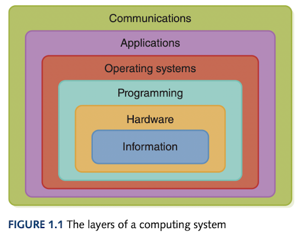
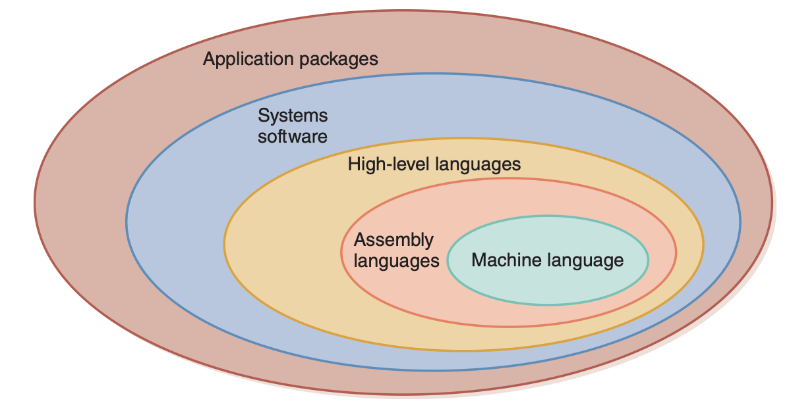

# Computer Science Illuminated Chapter 1

## Introduction
This blog is my first computer science blog and I wanted something with the breadth of the entire field to serve as an introduction.

Before getting into the first chapter, I think it's a good idea to understand the background of the book before actually delving inside the content. The authors of this book are John Lewis (born: 25/08/1963) from Virgina Tech. 
Funnily from his Wikipedia page [[1]](#1), his Twitter account is mistaken for others' identities ranging from a British Department store to the American politician and civil rights leader. At the time of writing this he is an adjunct professor at Virginia Tech but using 
the 3rd edition textbook from my university, it states he is at Villanova University. Nell Dale is the other co-author and is part of the IEEE Computer Society and was one of the first women to get a PhD in Computer Science in the 1970s and graduated and taught at the University of Texas, Austin.
Both of these authors have written extensively on programming languages for education and Lewis actively participates in the *ACM Special Interest Group on Computer Science Eduction* (SIGCSE) and Dale got an award from ACM SIGCSE in 1996.

## The Onion Layers
1. Information Layer
2. Hardware Layer
3. Programming Layer
4. Operating Systems Layer
5. Applications Layer
6. Communications Layer

The innermost layer - *Information Layer* - reflects the way information is represented on a computer. This is purely conceptual (using binary) and is used to represent a myriad of information types. 
The *Hardware Layer* includes devices such as gates and circuits which lead to CPU and memory. 
The *Programming Layer* deals with software, the instructions used to accomplish computations and manage data (in many forms and languages) to solve problems.
The *OS Layer* helps us interact with the computer system and manage how hardware, programs and data interact.
**These previous layers are for the computer system to work.** 
The *Applications Layer* focuses on solving specific real-world problems using domain-specific application programs. (AI, information systems and simulation)
The *Communication Layer* deals with connecting computers to networks and how they share information and resources.

## Laying the Groundwork
The start of the book goes into **The Big Picture** and defines a "Computing System" as the hardware, software and data to solve problems.

## Abstraction 
The levels discussed above are examples of abstraction - *a mental model which removes or hides complex details*. Human beings can actively manage about 7 $\pm$ 2 pieces of information in short-term memory at one time (**Miller's Law**).
7 is seen as a small number but with abstraction can represent a chunk of information for each slot.

## History of Computing
### History of Hardware (From abacus to UNIVAC)
- In early history times, people believed that the *Stonehenge* is an early form of calendar/astrological calculator. 
-The *abacus* ($16^{th}$ century BC) was developed fo record numeric values to perform basic arithmetic.
- *Blaise Pascal*, in the middle of the $17^{th}$ century built and sold gear-driven mechanical machines which performed integer addition and subtraction.
- Later in the same century, *Gottfried Wilhelm von Leibniz* built the first device designed for all 4 operations. It wasn't very reliable.
- *Jacquard's Loom* developed by Joseph Jacquard used a series of cards with punched holes and though not a computing device - was the first to use input.
- *Charles Babbage* designed the *Analytical Engine* which was never implemented but utilised memory, both numbers and mechanicals steps using punch cards.
- *Ada Augusta, Countess of Lovelace* extended and corrected Babbage's work, becoming the world's first programmer. The created the concept of a loop and has a language Ada (US D.o.D.)named after her.
- *William Burroughs* produced and sold a mechanical adding machine.
- *Dr. Herman Hollerith* developed the first electro-mechanical tabulator (revolutionizing the census) and later formed IBM.
- In 1936, *Alan Turing* invented an abstract mathematical model, the Turing machine.
- From WWII, the *Harvard Mark I* and the *ENIAC* are two of the more famous machines. *John von Neumann* was a consultant on the ENIAC project and started working on the *EDVAC* which was completed in 1950. 
- The *UNIVAC I* after was the first computer used to predict the outcome of a presidential election.

**First Generation (1951-1959):**
Commercial computers used vacuum tubes, generated a great deal of heat and was not reliable and required large specially-built rooms. The primary memory device was a *magnetic drum*. The input device was a card reader (descendant of Hollerith card). The output was either a punch card or line printer. By the end of this generation, magnetic tape drives had been developed.
Storage devices external to the computer memory are called *auxiliary devices*.

**Second Generation (1959-1965):**
The *transistor!* (which won a nobel prize). The memory used were *magnetic cores* and a new auxiliary device developed was *the magnetic disk*.

**Third Generation (1965-1971):** 
*Printed ciruit boards* were used in the previous generation. This generation was characterized by *Integrated Circuits* (IC). Moore's Law also came to be from Gordon Moore (co-founder of Intel).
Integrated-circuit technology allowed memory boards to be built by transistors but auxiliary storage devices were still needed as the information was wiped when the power went off.

**Fourth Generation (1971-?):**
*Large-scale Integration*  meant moving from several thousand transistors on a silicon chip to a whole microcomputer by the middle of the decade. The phrase *Personal Computer* (PC) had also been entered into the mainstream.
Apple, Hewlett-Packard, IBM, NCR, Remington Rand, DEC, Control Data and Burroughs...
The introduction of the RISC architecture and machine language and Sun Microsystems introduced a RISC chip on a workstation or UNIX workstations.
Moore's Law had also changed to: "Computers will either double in power at the same price or halve in cost for the same power every 18 months"

Parallel computing was introduced in the late 1980s and relied on parallel architectures on a set of interconnected CPUs either SIMD or MIMD.
Networking in the 1980s involved the invention of *The Ethernet* and its protocols and in 1979 DEC, Intel and Xerox made it a standard.
By 1989, PCs were connected together with a file server and LANs also came to be known.
The internet descended from *ARPANET* a government-sponsored network started in the late 1960s and uses packet switching.

### History of Software

**First Generation (1951-1959):**
The first programs were written using *machine language* - instructions built into the electrical circuitry of the the particular board. This implies that for every computer there is a different version of the machine language. The first artificial programming languages were developed and were *assembly* languages which replaces the bit instructions with mnemonics. Translators called *assemblers* were used to convert the mnemonic instructions into machine language. The programmers who created assembly which is a higher abstraction were the first *systems programmers* ie. making programming easier for others. 

**Second Generation (1959-1965):**
Using assembly languages still meant that the programmer had to think of programming as individual instructions and thus *high-level languages* were developed as a higher abstraction to think in terms of more complex terms. Two of the languages developed in this generation (that are still used today) are Fortran and COBOL. Fortran started as a simple language and developed additional features from there whereas COBOL was designed first then implemented. Another language was LISP - used mainly for AI and research as well as Scheme which is a dialect taught in SICP. A program can be translated and run on any machine when it has a compiler which translates high-level instructions into machine language. The *applications programmers* used these high-level tools whereas the *systems programmers* built the assemblers and compilers. 

**Third Generation (1965-1971):**
In this era, the humans were slowing the computers down as they were idle waiting for the user to input the next job. The solution to this was to to put the computer in charge of its own resources - an *operating system*. The *systems software* consisted of the *loaders*, *linkers*, the *operating system* and the translators. The loader is responsible for loading the program into memory and prepares them for execution and on Unix machines can do things like validation, memory-mapping to main memory, copying command-line arguments into main memory, initialising registers, and jumping to the program entry points.[[2]](#2) *Time sharing* was also used to better utilise the higher computing power with the slowness of input/output on keyboards and terminals. Lastly, general-purpose application programs were written such as statistical packages. These *applications programmers* were not writing for their fellow programmers but this time for the general public.

**Fourth Generation (1971-1989):**
This era saw the beginnings of *structured programming*, a disciplined approach to programming which relies on sequence, selection, iteration, subroutines, and blocks.[[3]](#3) From 50 years ago, we are still using this in contemporary applications. In this generation, better *operating systems* were developed such as Unix, MS-DOS, Macintosh, and PC-DOS (IBM). 

**Fifth Generation (1990-Present):**
Object-oriented design became the go-to for many programmers in large-scale projects. This shifts the focus from instructions or procedures being a hierarchy of tasks to a hierarchy of data objects. In 1990, Tim Berners-Lee created a set of technical rules (HTTP) that would become the *World Wide Web*. He also created HTML and a text-only browser. I'll get back to the difference between the *Internet* and the *World Wide Web*. 

## Computing as a Tool and Discipline
There are two groups of programmers: the *systems programmers* that makes the tools in making programming easier and the *applications programmers* who used these tools initially but now build domain-specific programs for non-tech-savvy users. A discipine is defined as a field of study which for Computer Science is defined by Peter Denning as "*the body of knowledge of computing is frequently described as teh systematic study of algorithmic processes the describe and transform information: their theory, analysis, design, efficiency, implementation, and application.*" Denning states that each practitioner must be skilled in these four areas:
- Algorithmic thinking (express problems into procedures)
- Representation (store data in an efficient manner)
- Programming (combines algorithmic thinking and representation into software)
- Design (the software serves a useful purpose)

Computer science is unique in the fact that it is able to be described as a mathematical discipline (from Turing's works on unsolvable problems, boolean algebra and numerical analysis in scientific computing), a scientific discipline (build and test models of natural phenomena) and engineering where larger computing systems requires a structured framework and design. The subareas outlined by the taskforce to create a curriculum include:
- Algorithms and Data Structures (*systems*)
- Programming Languages (*systems*)
- Architecture (*systems*)
- Numerical and Symbolic Computation (*applications*)
- Operating Systems (*systems*)
- Software Methodology and Engineering (*systems*)
- Databases and Information Retrieval (*applications*)
- AI and Robotics (*applications*)
- Human-computer Communication (*systems*)
- Graphics (*applications*)
- Organisational Informatics (*applications*)
- Bioinformatics (*applications*)

As a future data scientist and starting my Masters of Data Science next year, I am more of an applications programmer since I'll be using 'Numerical and Symbolic Computation', 'Databases and Information Retrieval' and 'AI'. However, I am very interested in 'ADT', 'Architecture', 'OS', and 'Graphics'.

## References
<a id="1">[1]</a> 
[John Lewis](https://en.wikipedia.org/wiki/John_Lewis_(computer_scientist))

<a id="2">[2]</a> 
[Loader](https://en.wikipedia.org/wiki/Loader_(computing))

<a id="3">[3]</a> 
[Structured Programming](https://en.wikipedia.org/wiki/Structured_programming)
