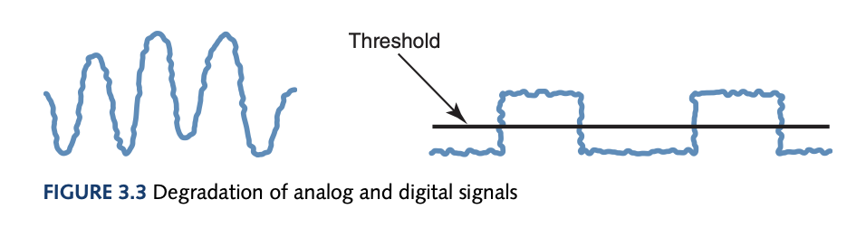
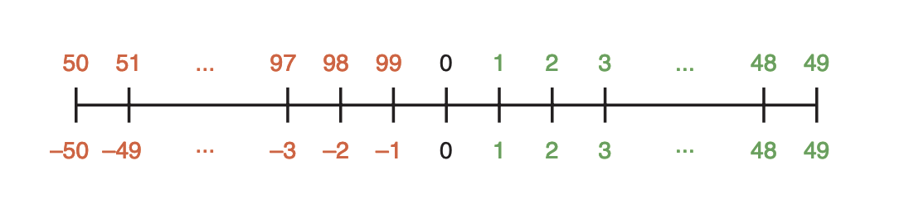
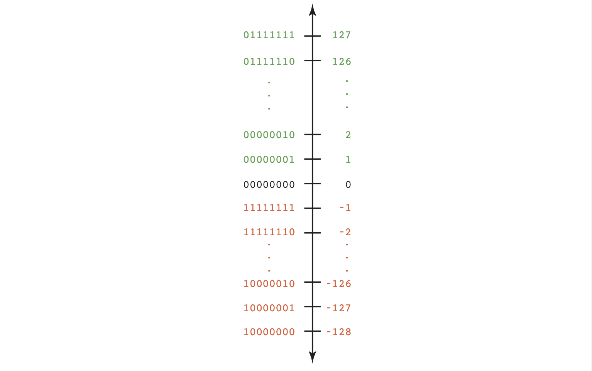
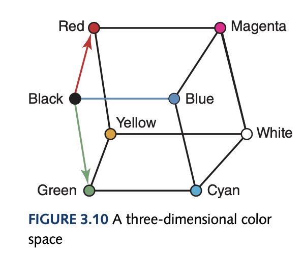

# Computer Science Illuminated Chapter 3 - Data Representation

## Introduction
As defined before, a computer takes some data and performs functions on it and outputs the result. The data itself can be of any format of numbers in some form of representation that is outputted in some representation from the comptutation. Historically, computers were glorified calculators solving algorithms and numerical problems but nowadays, the once humble computer can work on images, sound, and text for more abstractions of problems and solutions for many industries such as the music or cinema industries.

## What is Data?
*Data* are basic values or facts and *Information* is data that has been organised or processed in way that is useful. All data in this context is represented as binary digits. Data compression is the idea of storing a piece of data at a reduced size. The reason for this is due to the *Bandwidth* - the number of bits/bytes that can be transmitted from one place to another in a fixed amount of time - constrained by the World Wide Web. This can be quantified by the compression ratio:
$$
ratio = \frac{\text{size of compressed data}}{\text{size of original data}}
$$
*Lossless* compression means there is no loss in information from compression and *Lossy* compression is when there is a loss of information.

## Analog vs Digital Data
This book completely changed my outlook on the possibilities of a computer simulating the universe. I do not think this is possible anymore due to the distinct inherent natures possessed by the universe and the computer. The universe or reality is continuous and infinite whereas, the computer deals with discrete and finite values. Hence, a function mapping the continuous to the computer's discrete system is why representation is needed. *Analog data* is a continuous representation (analog computers also exist), analogous to the information it represents. *Digital data* is a discrete representation, breaking the *information* into separate elements. Computers can't work well with analog data and must *digitize* this data by breaking the continuous data into pieces and represent the pieces separately. The binary system is used as it is much simpler to have one threshold where a low-voltage represents 0 and a high-voltage represents 1. As time continues, this signal will degrade and the original signal will be lost. Periodicaly, this signal is reclocked before no information is lost. An analog signal will have information lost even after reclocking due more possibilities in losing information in its structure rather than a digital signal shown below.

## Representing Numeric Data

### Representation of Negative Values
To represent negative values, a *signed-magnitude* reprsentation can be used with the most significant bit to represent positive and negative integers. A caveat with this approach is the existence of both positive and negative numbers which causes unnecessary complexity for a computer. Another approach is *fixed-size* representations of numbers where we take a fixed number of values and represent half of these integers as some negative number. For example:

This still works with addition and subtraction where $A-B = A + (-B)$ (where you add the negative representation for subtraction). This is just addition and subtraction with modulo. A formula to compute the negative representation is:
$$
Negative(I) = 10^k - I, \text{ where k is the number of digits}
$$
For this formula to work ensure the largest positive integer is half of some power of the base. This representation of numbers is called the *N's complement* where N is some base. With the two's complement, the leftmost bit in a negative number is always 1.

### Representation of Real Numbers
The positions to the right of the radix point are $N^{-1}$, $N^{-2}$ and so on, based on positional notation. To represent a real number, we store the value as an integer and include information on where the radix point is. A real value of base N can by de defined by:
$$
\text{sign}\; \cdot\; \text{mantissa}\; \cdot\; N^{\text{exp}} 
$$

The mantissa above is just the digits that make up the value with the radix point assumed to be on the right. This is the floating point representation since the radix point floats or is able to move around dependingo on the exponent. A positive exponent shifts the radix point to the right and a negative exponent shifts to the left. To store a floating point number in binary on a computer with 64 bits would need 1 bit for the sign, 11 bits for the exponent, and 52 bits for the mantissa (in IEEE-754 or Double Precision). 

##### How do we convert base N fractional numbers to decimal fractional numbers?
In the same vein as integers, multiplying out the positional notation will give the decimal result.
$$
0.11_2 = 1\cdot2^{-1} + 1\cdot2^{-2} = 0.75_{10}
$$

##### How do we convert decimal fractional numbers to base N fractional numbers?
The conversion process is multiplying by the new base where the carry becomes the next digit to the right in the answer.

To convert 0.75 to binary:
$$
0.75 \cdot 2 = 1.50, \text{take the 1 as the right of the answer .1\_ and use 0.50}
\newline
0.50 \cdot 2 = 1.00, \text{take the 1 as the right of the answer .11 and you are done!}
$$

Why does this algorithm work?

$$
0.75_{10} = 0.11_2
\\
0.75 = 1 \cdot 2^{-1} + 1 \cdot 2^{-2}, \text{we can get the first one by multiplying by 2 to make it the integer part}
\\
0.75 \cdot 2 = 1.50 = 1 + 1 \cdot 2^{-1}, \text{to get the next digit we do the same as above but get rid of the whole part}
\\
0.50 = 1 \cdot 2^{-1}, \text{keep going until hit 0 or recurring} 
$$

## Representing Text

The common *character set* used or the list of characters with their associated codes are the ASCII Character Set. ASCII stands for American Standard Code for Information Interchange and uses 7 bits to represent each character. The Unicode Character Set contains the ASCII set as a superset and uses 16 bits to represent each character, enough for international use. The three types of encoding are keyword encoding, run-length encoding, and Huffman encoding. Keyword encoding replaces frequently used word with a single character, run-length encoding replaces a repetition of single characters (think DNA sequences) with a flag character and the character with how many times it is repeated, and Huffman encoding uses variable-length bit strings where more commonly used characters use less bits (the methodology will be explained in a DSA overview later). 

## Representing Audio
To represent audio we must first understand the continuous nature of sound. Sound is a series of air compressions that travel to our ear and hits a membrane which converts the frequency and density (amplitude) as sound waves to our brain. A speaker simulates this by using an electromagnet to move a cone which pushes air based on the voltage and frequency the current powers the electromagnet. To represent audio data on a computer, we must digitize the sound wave by sampling the continuous sound wave's voltage into a series of discrete values (assuming the change is constant between samples). A vinyl is an analog representation whereas, a Compact Disk (CD) stores it digitally where the surface contains microscopic pits for a laser to reflect off for a receptor to capture and gather the voltage values to be transmitted to the device.

Audio formats such as WAV, AU, MP3 etc. are just based on the storage of voltage values. The most popular form is MP3 due to its superior compression ratio utilising both lossy compression in discarding information unable to be heard by humans and using a form of huffman encoding on the bit stream. 

## Representing Images
Our eyes have three types of colour photoreceptor cells each corresponding to red, green, and blue. Using RGB format where 0 to 255 (8 bits for each colour) is used to represent the strength of each colour. Mathematically, this gives rise to a three-dimensional colour space.

The *colour depth* is used to refer to the amount of data used to represent a colour. HiColor uses a 16-bit colour depth which is 5 bits for each RGB colour and 1 bit for transparency. TrueColor is a 24-bit colour depth where each RGB colour gets 8 bits.

To represent images, the analog representation is a photograph where shades of colours blend into each other which fundamentally can't be represented in a computer. However, with enough pixels and a high enough *resolution* (the number of pixels used to represent a picture) you can simulate this behaviour. *Raster-graphics format* is the storage of image information on a pixel-by-pixel basis such as bitmap (BMP), GIF, and JPEG. *Vector Representation* is representing an image in terms of lines and shapes where the formats are Flash and SVG. 

## Representing Video
A video *codec* (COmpress/DECompressor) refers to the methods used to shrink the size of a movie so that it can be played over a network. Almost all video codecs use lossy compression and are block oriented, meaning each frame is divided into rectangular blocks. *Temporal compression* looks for differences between consecutive frames and a keyframe is chosen on which to compare the differences where only the changes (delta frames) are stored. *Spatial compression* removes the redundant information in a frame, grouping pixels into block that have the same colour. 
