# Computer Science Illuminated Chapter 4 - Gates and Circuits

## Introduction
Now that we have our binary system and its corresponding representations for different types of data to work with, we must be able  to express these ideas through hardware or electronic devices that harness the power of a lightning bolt to do work. 

This is done by using *gates* - a device that performs a basic operation on electrical signals, accepting one or more input signals and producing a single output signal. Gates are then combined into circuits designed to accomplish a specific logical function. 

## Gates
To represent gates, we use Boolean expressions (after its inventor George Boole) which gives a powerful way to symbollicaly manipulate and even simplify circuit designs. A logic diagram is a graphical representation of the circuit and a truth table defines the output based on a list of all possible input combinations. The gates and their representations are:

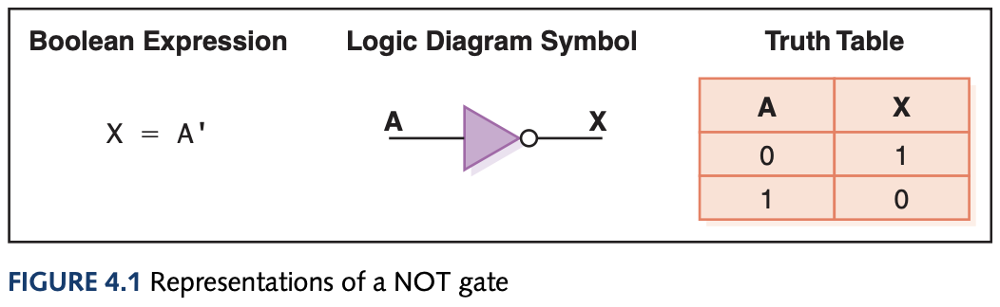
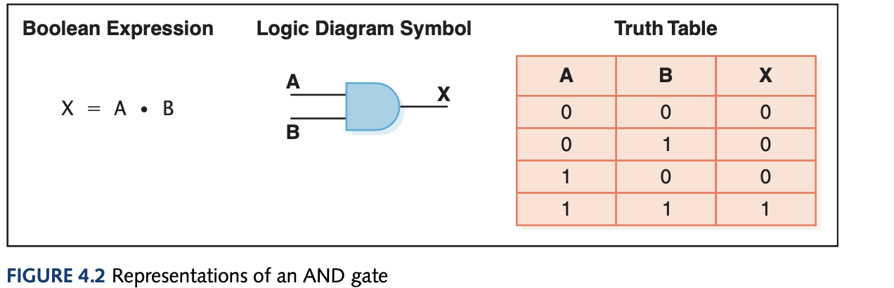
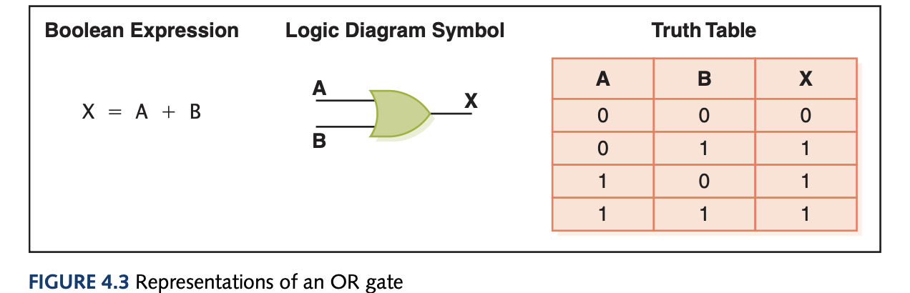
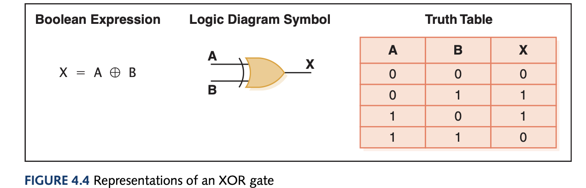
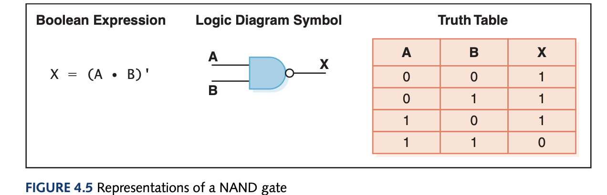
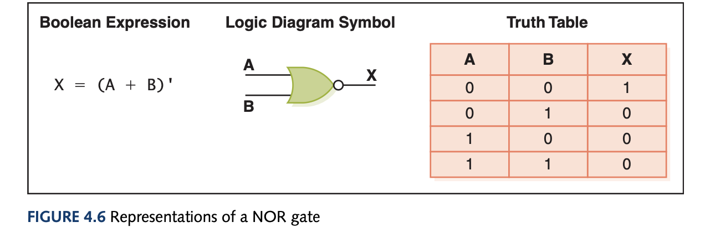

Gates can have more than 2 inputs, for instance the AND gate would need all three inputs to be 1 to output 1 and the rest of the combinations output 0. You can also use sum of products for unknown circuits using boolean algebra and simplify the expression to get the simplified boolean expression of some hard to understand truth table.

To create gates we must also understand the basics of electricity (to talk about their underlying transistors). An electrical signal has a source (battery), if the electrical signal is grounded, it is allowed to flow through an alternative route to the ground - where it can't harm. A grounded electrical signal is pulled down to 0V. A transistor (I think this book talks about N-type transistors only) has three terminals: a source, a base, and an emitter.

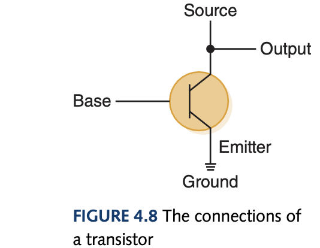

An output line is connected to the source line and if the base signal is high (close to +5V), the source signal is grounded, which turns the transistor off due to path of least resistance to the ground signal rather than completing the circuit with the base signal. If the base signal is low (close to 0V), the source signal stays high and the transistor is on. Because of the way a transistor works, it much cheaper and easier to make NOT, NAND, and NOR gates.

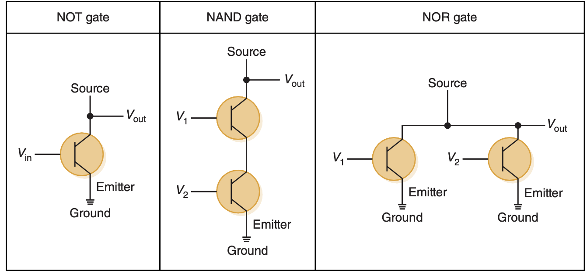

## Circuits
Circuits can either be *combinational* whose output is solely determined by its input values or *sequential* whose output is determined by a function of input values and the the current state of the circuit. Combinational circuits are useful for describing more complex logical behaviours and are useful in making half adders (adds only a bit), full adders (adds multiple bits), and multiplexers (using select control lines to forward a specific output from multiple choices).

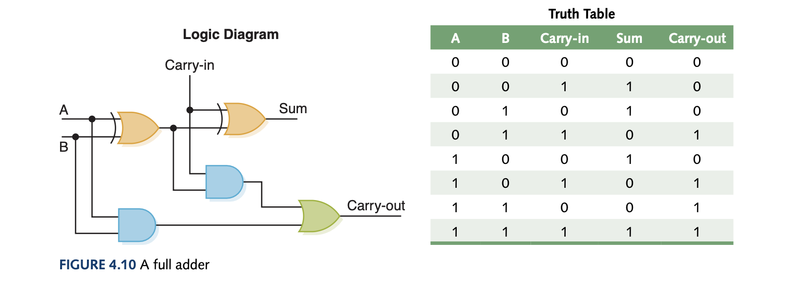
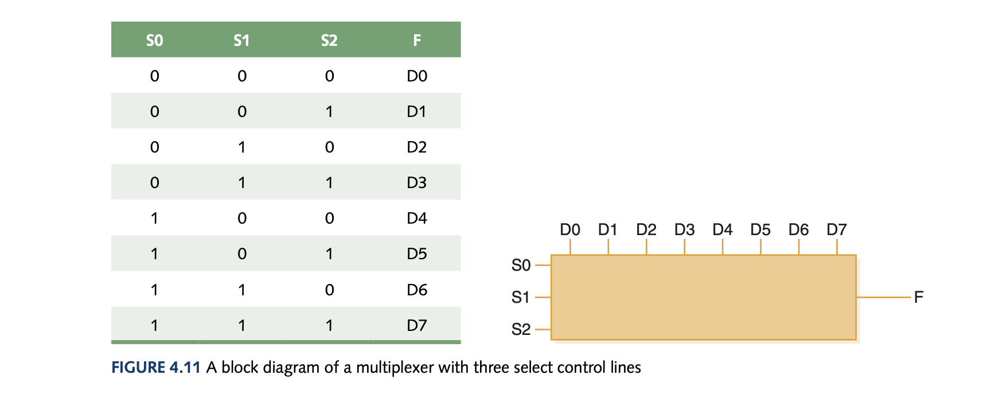

There also exists a *demultiplexer* which takes a single output and routes it to one of $2^n$ outputs depending on the value of the n control lines.

#### Circuits as Memory
Sequential circuits can store information where the output of the circuit serves as input to the circuit on the next iteration. An S-R latch can store a single binary value where the outputs X and Y are always complements of each other. If both input values S and R are 1 then the circuit is in its existing state. To actually set the values we set S to 0 and then X becomes 1 as long as S is immediately returned to 1 and the same is done for R for setting Y to 1. 

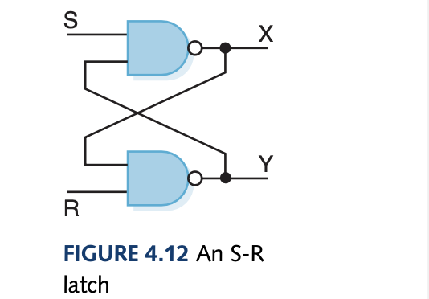

*Integrated circuits* is a piece of silicon on which multiple gates have been embedded.
