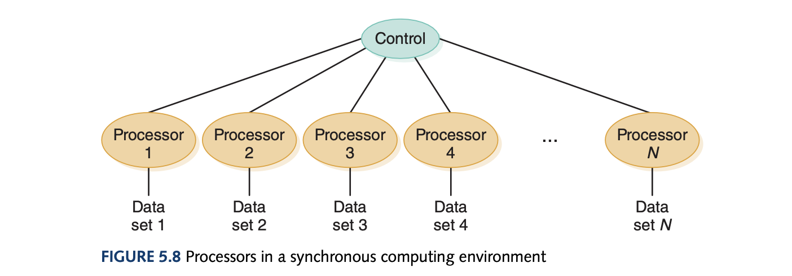
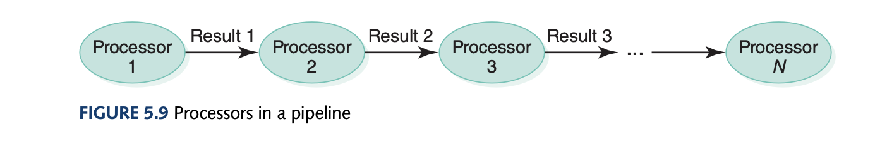
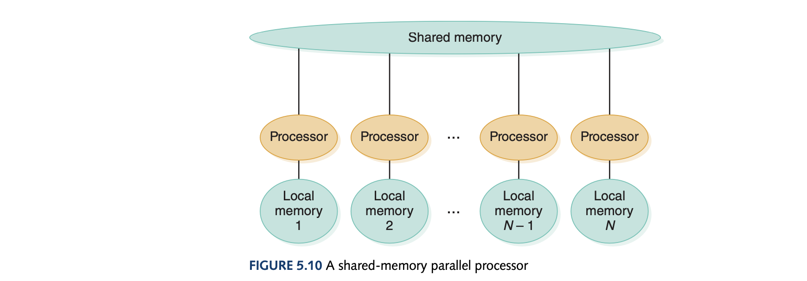

# Computer Science Illuminated Chapter 5 - Computing Components

## Introduction
The major components that are needed that make computers "computers" are the CPU and main memory. This is just another level of abstraction on top of the gates and circuits discussed in chapter 4. 

*Extra:* Did you know that when referring to time/speed powers of 10 are used and when referring to storage powers of 2 are used. This is because storage capacity is always expressed in bytes which are a power of 2 but time is expressed in bits and can be expressed in decimal notation.

## Stored-Program Concept
A significant milestone in the history of computing is understanding that data and the instructions used to manipulate the data were logically the same and could be stored in the same place. This is called the *Von Neumann architecture* which is still the basis for computers today. The idea most likely originated from Eckert and Mauchly who worked on the ENIAC where Von Neumann looked at their ideas.

In this architecture, the units that process information and the units that store the information are separate. This leads to 5 fundamental components:
- The memory unit (holding the data and instructions)
- The Arithmetic/Logic Unit (ALU) that is capable of performing arithmetic and logic operations on data
- The input unit that moves data from the outside into the computer
- The output unit that moves results from the computer outside
- The control unit acts as a stage manager that ensures all other components act correctly

### Memory

Memory is just a collection of cells where each cell has some *addressability* or the number of bits in each addressable location. Today's computers mostly are byte addressable. The addresses are labelled consecutively from 0 to however many addresses there are. For example, if the word length is 8 bits which means the maximum addressability is $2^8$ which means it can uniquely identify 256 memory locations. 

### Arithmetic/Logic Unit

The ALU can perform local operations such as AND, OR, and NOT as well as being able to add, subtract, multiply, and divide. It operates on words which means the word length of the computer is the size of the quantities processed by the ALU. Most modern ALUs have special storage units called registers to store intermediate values or special data. The access to registers is much faster than memory locations as it is much more local to the processing.

### Input/Output Units
Input units could be punched cards or tape to terminal keyboards, the mouse and scanning devices at supermarkets as an example. Output units could be printers or video display terminals.

### Control Unit

This unit is in charge of the fetch-decode-execute cycle and includes two registers: the *instruction register* (IR) contains the instruction being executed and *program counter* (PC) which contains the address of the next instruction to be executed. Since, the ALU and the Control Unit work so closely they are grouped into one unit called the *Central Processing Unit* (CPU) 

## The Fetch-Execute Cycle

### Fetch the Instruction
The PC contains the address of the next instruction and the Control Unit goes to this address and make a copy of its contents and places this in the IR. Before executing the instruction, the PC must be updated to hold the address of the next instruction and because the instructions are stored contiguously, the PC is just incremented by 1 by the Control Unit. Accessing memory takes one cycle. The PC can be changed later by the instructions being executed.

### Decode the Instruction
This is the most interesting part. To execute the instructions in the IR, they are decoded into control signals which is determined by the logic of the circuitry or in other words, *The instructions are literally built into the circuits*. This is why each machine has its own machine language.

### Get Data if Needed
The instruction may require additional memory and the Control Unit may need to get the contents of a memory location specified in the instruction to be processed with or at the register.

### Execute the Instruction
Once an instruction has been decoded and all operands fetched, the Control Unit is ready to execute the instruction. Execution involves the ALU for processing. The cycle will begin again after this execution where the next instruction may be to store the contents of a register or a control instruction - asking a question about the last instruction.

## RAM vs ROM
Random Access Memory (RAM) is where each memory cell can be *directly* accessed and can be changed as well. As both data and instructions are stored in this memory we may unintentionally change the instructions which may have catastrophic consequences. Read-only Memory (ROM) solves this as the contents cannot be changed. Placing a bit pattern in ROM is called *burning* and is done at manufacturing or assembly time. ROM is also not volatile where RAM is. Note that ROM is also random access. 

## Secondary Storage Devices
Secondary storage devices are devices that are not volatile and store memory outside of the main memory and is also an I/O device. Magnetic tapes were the first mass auxiliary storage device where the only drawback was having to go through the entire beginning of the tape to reach the middle. Magnetic disks are a bunch of disks with R/W heads on each of them grouped by track, sector, block, and cylinder. The time taken is based on the seek time (time it takes for the R/W head to be positioned over the track), latency (time it takes for the specified sector to spin under the R/W head), access time (time it takes for block to start being read; seek_time + latency), and transfer rate (the rate at which data moves from disk to memory). There are also CDs and DVDs. 

## Non-von Neumann Architectures
Since 1990, alternative parallel-processing systems have emerged. *Synchronous processing* uses multiple processors applied to the same program in lock-step to multiple datasets.

Another architecture is to configure the processors in tandem where some processor does a specific task and all the processors below work on the next instruction to be computed analogous to an assembly line.

Lastly, the shared memory architecture has multiple processors shared with a global memory. 

- In synchronous processing, each processor is doing the same thing to a different dataset. 
- In pipeline process, each processor is doing a different thing to the same dataset.
- In shared memory, each processor is doing different things with different datasets.

