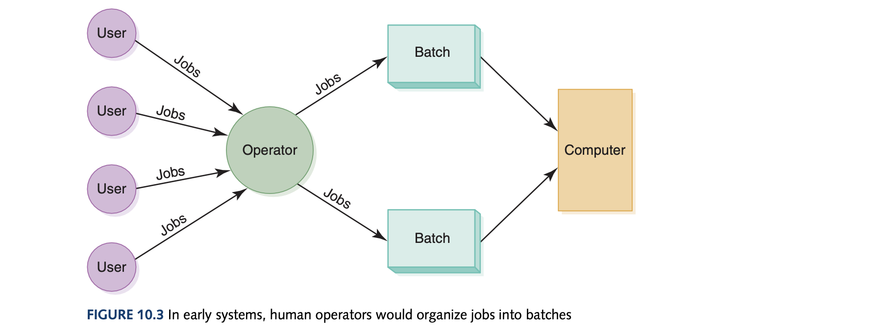
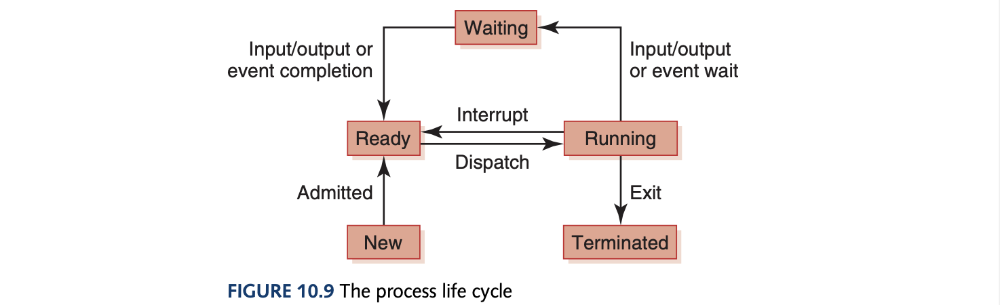

# Computer Science Illuminated Chapter 10 - Operating Systems

## Introduction
There are a lot of differing definitions and roles attributed to the operatings systems (OS). Likening this piece of software to the once human operators of computers (running on punch cards). A miraculous piece of software that is able to manage itself as it too uses the same CPU and memory as application processes and must take its turn alongside other programs. It can also be likened to a middle ground or intersection between the software and hardware. The OS has a myriad of roles which can be simplified to 1. "*Sharing Nicely*" and 2. "*Interface to Hardware*" (especially useful for application programmers).

The roles are:
- Memory, Process (dynamic representation of a program during execution), and CPU management - **(1)**
- Batch Processing (saves much saved operational costs and time by executing jobs with similar needs for special software and systems resources in batches) - **(1)**
- Timesharing - **(1)**
- Networks - **(2)**
- Device drivers (using code for the way a particular device expects and receives info. from the manufacturing company's website to the operating system)- **(2)**
- Real-time System - **optimizing (1)**

## Memory Management
Operating systems must employ techniques to convert logical program addresses into actual memory addresses and track where and how a program resides in memory. To uses logical addresses we use *address binding* which is a mapping from a logical address to a physical address. The longer we wait to bind a logical address, the more flexibility we have.

### Single Contiguous Memory Management
From secondary memory, you bring in only one program which is loaded into one contiguous chunk of main memory alongside the OS at address 0. The address binding for this is to add the starting point of the program $A$ and the logical address's offset from this point $L$ which is $A+L$. Usually, the OS is at 0 so the application program doesn't accidentally try to access the OS.

### Partition Memory Management
A better method is to have more than one program in memory at the same time, sharing memory space. Memory must be divided into more than 2 partitions unlike the previous method. *Fixed partitions* is where memory is divided into a specific number of partitions (partitions do not have to be the same size but their size is fixed). *Dynamic partitions* is where memory is divided into partitions ad hoc to accommodate programs. This is much more efficient since *dynamic partition* technique involves compaction where all the jobs are shuffled around in memory to create one large free partition. Address binding uses a base register for the current program being run and the bounds register holds the length. A check is then done to see if the accessing is overstepping the bounds of the partition size but is still $A+L$ as before.

### Paged Memory Management
In this technique, processes are divided into fixed-size pages and stored in memory frames which are fixed-size portions of main memory when loaded. *How are processes - a dynamic entity - divided into pages?* They are dividing the logical address space not the dynamic entity itself which is still saved on registers which is also managed by the OS. A *page-map table* is maintained by the OS for each process mapping each page to its corresponding frame. The address binding is done by $<\text{page}, \text{offset}>$ where it is 
$$
\text{page\_size} \cdot \text{page} + \text{offset}
$$
*Demand paging* is an extension where pages are brought into memory only when referenced which causes a *page swap* where bringing one page from secondary memory possibly causes another page to be removed. This gives rise to the concept of *virtual memory* - the illusion that there are no restrictions on the size of the program (all of the program does not have to be loaded into memory at once). However, too many page swaps can lead to *thrashing* which is quite inefficient.

## Process Management
Processes move through specific states as it is managed by an OS.

The *process control block* (PCB) is a data structure used by the OS to manage information about a process. Each state is represented by a list of PCBs and stores the value of all CPU registers for that process (which is only one set of registers for one CPU) and contains the values of teh currently executing process. A *context switch* is the exchange of register information when one process is removed from the CPU and another takes its place.

## CPU Scheduling
CPU scheduling that occurs when the currently executing process gives up the CPU voluntarily (from the running state to waiting state or termination) is a *nonpreemptive scheduling* algorithm. CPU scheduling that occurs when the OS favors another process is *preemptive scheduling* since the the currently running process is preempted by OS. *Turnaround time* is a metric that measures elapsed time between a process's arrival in the ready state and its completion.
- First-Come, First Served: Nonpreemptive, easy to implement
- Shortest Job Next (SJN): Nonpreemptive, uses probability factors and accounting for type of job to predict without guarantee the service time
- Round Robin: Preemptive, takes a *time slice* which is the amount of time given for each process before it is preempted to the next process

