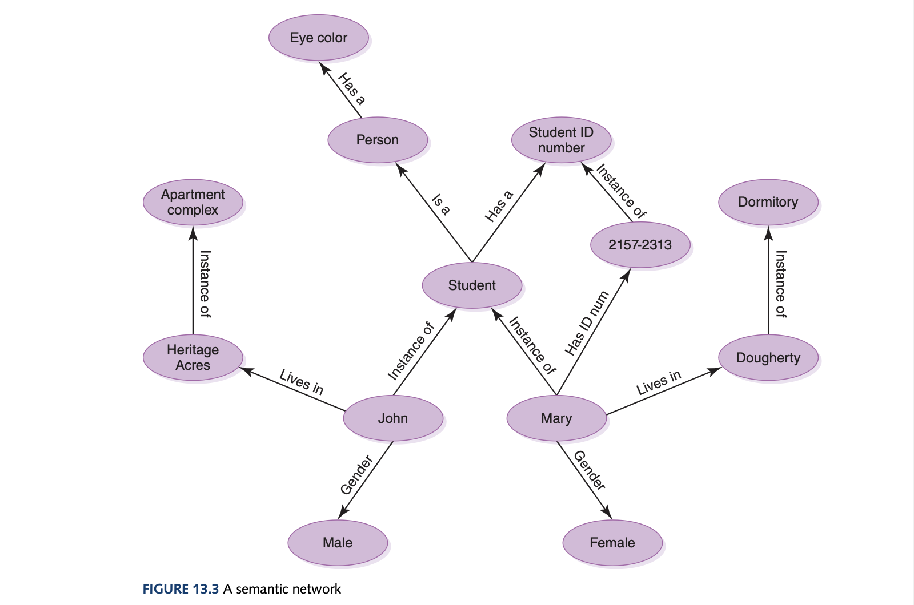

# Computer Science Illuminated Chapter 13 - Artificial Intelligence

## Introduction
Artificial Intelligence (AI) represents the future of computing but more importantly is a new avenue for applying different technologies to problem solving. It is the study of computer systems that model and apply the intelligence of the human mind. This is all the more difficult knowing that computers are only good at computations and humans are better at reasoning. The *Turing test* was formulated to determine whether a computer system is intelligent. However, some voiced concerns saying a computer doesn't necessarily need to understand language discourse to be considered truly intelligent (which I agree, especially after ChatGPT-4o). A computer that passes this test demonstrates *weak equivalence* - the equality of two systems based on their results - and *strong equivalence* - the equality of two systems ased on their results and the process by which they arrived at those results. True AI to me, especially AGI would assert *strong equivalence* rather than the statistical models we have nowadays. The Loebner prize is the first formal instantiation of the Turing test, held annually. 

## Knowledge Representation
The knowledge needed to represent and object or event is based on the situation. For AI, we want to capture facts and relationships. 

### Semantic Networks
*Semantic networks* are a knowledge representation technique that represents the relationships among objects. A dircted graph is used to represent the relationships which could be *is-a*, *instance-of*, or anything else as relationships (notice the is-a, instance-of are from the object-oriented paradigm). The type of relationships are dependent on how we want to solve the problem but is quite hard to process complex questions on the data as a network. 

### Search Trees
We use trees to represent possible alternatives in adversarial situations, such as game playing. A *search tree* represents all possible moves in a game for both you and your opponent. However, much more complex games such as chess will require pruning the tree for unreasonable moves and specifying a depth limit for the tree of one move. Between the Breadth-First Search (BFS) and Depth-First Search (DFS), the BFS tends to yield the best results.

## Expert Systems
A *knowledge-based system* is a software that uses a specific set of information. An *expert system* (which is often used interchangeably), is a software system based on the knowledge of human experts. An expert system is a *rule-based system* which is a software system based on a set of *if-then* rules. The *inference engine* the part of software that processes the rules to draw conclusions. An expert system will ask questions to gather data and goes through the applicable rules (where some rules affect the applicability of others) and this continually loops until it reaches a conclusion.

## Neural Networks
An *arftificial neural network* (ANN) is a computer representation of knowledge that attempts to mimic the neural networks of the human body. let's look at a biological neural network first to make inferences.

A neuron is a single cell that conducts a chemically based electronic signal. The human brains have billions of these in a network (many AI models have more than billions). A neuron can either be in an *excited state* which conducts a strong signal or an *inhibited state* which conducts a weak signal. A biological neuron has input tentacles called *dendrites* and one primary output tentacle called an *axon*. The gap between an *axon* and a *dendrite* is a *synapse* which tempers the strength of the input signal (acts as the weight!). A neuron accepts multiple input signals and if enough of these weighted input signals are strong, the neuron enters an excited state and produces a strong output signal.

For ANNs, each processing element is analogous to a biological neuron where a single output value is 0 (inhibited) or 1 (excited). Associated with each input value from other neurons is a weight which can be positive or negative. The effective weight is the sum of the weights multiplied by the corresponding input values such as $v_1 \cdot w_1 + v_2 \cdot w_2 + v_3 \cdot w_3$. Each element has a numeric threshold value. If the element compares this effective weight to this threshold value then it produces 1 if the effective weight is greater and 0 if not. If the output is 0 then any weight applied on it means nothing to the calculation of the effective weight in a later element. Note that the threshold value of that element is only for that specific neuron so for the same inputs one neuron could be excited wheras another will be inhibited. We can affect the processing of an ANN by changing the weights and threshold values which is called *training* to get a desired outcome. Initially, all weights, threshold values and initial inputs are just random.

## Natural Language Processing (NLP)
The three basic types of processing that occur between human-computer voice interaction are:
- Voice Recognition - recognising human words
- Natural Language Comprehension - interpreting human communication
- Voice Synthesis - recreating human speech

### Voice Recognition
Humans all have unique shapes to their mouth, tongue, throat, and nasal activities as well as regional accents or speech inpediments and much more that makes their speaking unique. Humans are great at dividing continuous series of sounds into words but can also be confused. Also there are issues with homonyms which is easy for us to decipher based on context. However, all these things that we can reasonably handle well seem daunting for a computer but the best success is in disjointed speech where words are clearly separated. Further success is through "training" it to recognise a particular human's voice and set of vocabulary words. A *voiceprint* is the plot of frequency changes over time representing the sound of human speech. This is actually what I personally have done in my DECO3801 course where I had to train the whisper-small model to understand Australian sland and trained it on my own voice. 

### Natural Language Comprehension
Natural language is inherently ambiguous where the same syntactic structure could have multiple valid interpretations, again requiring context for us to make understanding. 
- *Lexical ambiguity*: The ambiguity created when words have multiple meanings
- *Syntactic ambiguity*: The ambiguity created when sentences can be constructed in various ways
- *Referential ambiguity*: The ambiguity created when pronouns could be applied to muliple objects

### Voice Synthesis
You can use *dynamic voice generation* where a computer examines letters in a word and produces the corresponding sounds of the *phonemes* (the set of fundamental sounds made in any given natural language). However, the way we pronounce words varies greatly among humans and the rules governing each letter's sounds are not consistent. In this approach, the voice sounds mechanical and stilted. The other approach is to use *recorded speech* where digital recordings of a human voice play where words are combined or even whole phrases are recorded. Some words may have to be recorded several times with different pronounciations. However, this approach is limited in its vocabulary and needs the memory capacity to store all the needed words.

## Robotics
The robots focused on here that require AI are *mobile* robots not *fixed* robots. Modeling the world of the mobile robot requires AI. The *Sense-Plan-Act paradigm* (SPA) is where sensor data are interpreted by the world model which generates a plan of action. The robot's control system (hardware) executes the steps in the plan. This cycle repeats with new data being incorporated into the **semantic network**. The flaws however is that the representation of the robot's world is too general and not tailored to the robot's task. A paradigm shift then occurred towards the *subsumption architecture*. Rather than trying to model the entire world each time, the robot is given a simple set of behaviours where they each have their own corresponding piece of the world model to act on. The behaviours then run in parallel but if they come into conflict, an ordering of the goals of the behaviours determine which behaviour should be executed next. The three laws of robotics from Isaac Asimov fit neatly into this architecture.

Another shift in robotics is seeing the world as a topological map instead of a uniform grid by viewing this space as a graph connected by arcs. Finally, in the 1990s a modified approach used both of these approaches in conjunctions with a set of behavious with distributed world views.
