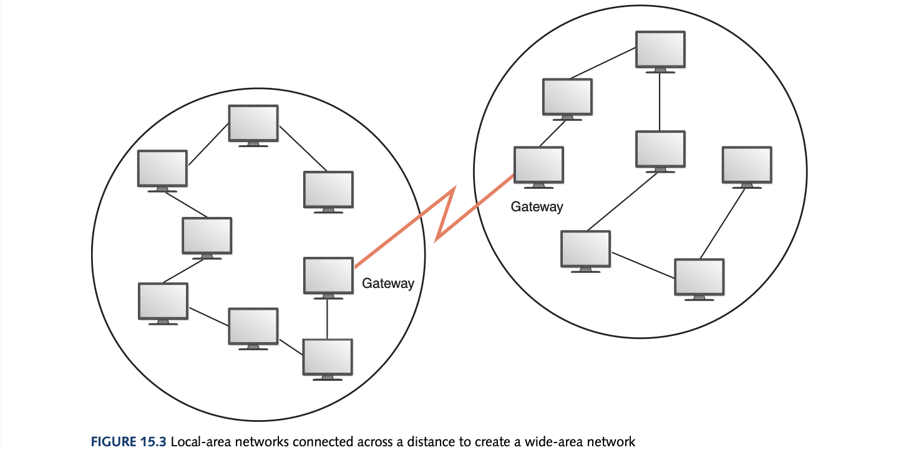

# Computer Science Illuminated Chapter 15 - Networks

## Introduction
The communications layer is the topmost layer and is one of the most significant milestones where communication between multiple computers from anywhere in the world is possible in the distribution of data.

## Networking
A *computer network* is a collection of computing devices connected so they can communicate and share resources. A node/host is any addressable device attached to a network. The issues with networks are the bandwidth (data transfer rate) and the protocols - a set of rules that defines how data is formatted and processed on a network - they use. A *web server* is a computer dedicated to responding to requests for web pages and a *file server* is a computer dedicated to storing and managing files for network users. These use the *client/server model* which is a distributed approach in which a client makes requests of a server and the server responds. 

### Types of Networks
A *local-area network* (LAN) connects a small number of nodes in a close geographic area. Various configurations called topologies can be used to administer LANs such as a ring, star, or bus topology. The bus topology uses the Ethernet, the industry standard for LANs. A *wide-area network* (WAN) connects two or more LANs over a potentially large geographic distance. One particular node on a LAN is set up as a *gateway* to handle communication between its LAN and other networks. The *metropolitan-area network* (MAN) is a network infrastructure that covers a campus or city. Communication between networks is called 'internetworking'. 

The *internet* is the ultimate WAN, spanning the entire globe. It is a vast collection of smaller networks that have agreed to communicate using the same protocols (which will be touched on later) and to pass along messages so they can reach their final destination.

### Internet Connections
Nobody owns the Internet in its entirety. The *internet backbone* refers to a set of high-capacity data routes that carry internet traffic. These routes are provided by ISPs, goverment, and academic sources. An *Internet service provider* (ISP) is a company that provides other companies or individuals with access to the Internet. They either connect to the backbone or a larger ISP which has connection to the backbone. The three most popular techniques for home connection are:
- *Phone modem* (modulator/demodulator): converts computer data into analog audio signal for transfer over telephone line to another modem to be converted back to data; slowest method (max. 64Kb/s), needs to "dial up" for connection
- *Digital Subscriber Line* (DSL): uses regular copper phone lines (similar to above) but transfer digital signals this time, maintains an active connection with between computer and ISP, must be within a certain distance from the central office otherwise signal degrades (as talked about in chapter 3), classified as broadband (min. 128K bps)
- *Cable modem*: data is transferred on the same line that your cable TV signal come in on; classified as broadband

Both DSL and cable modems are quite similar in their speeds of 1.5 to 3 Mbps. Download dominates traffic which is why many DSL and cable modem suppliers use technology that devotes more speed to downloads. 

### Packet Switching
To improve the efficiency of transferring data, messages are divided into fixed-size, numbered *packets*. *Packet switching* is where packets are individually routed to their destination, then reassembled. A *router* is a network device that directs a packet between networks towards its final destination. A *repeater* is a network device that strengthens and propagates a signal along a long communication line so the signal won't lose information if it degrades over something like an ocean.

## Open Systems and Protocols
A *proprietary system* is a system that uses technologies kept private by a particular commercial vendor however this didn't help with *interoperability* where the software and hardware on multiple machines and from multiple commercial vendors can communicate. However, an *open system* is based on a common model of network architecture and an accompanying suite of protocols. The OSI Reference Model is a seven-layer logical breakdown of network interaction to facilitate communication standards.

### Network Protocols 
Network protocols are layered such that higher protocols rely on the protocols that underlie it. This layering is called a *protocol stack*. A protcol is an agreement that a particular type of data will be formatted in some particular manner. 

*TCP/IP* refers to a suite of protocols and programs that support low-level network communication. TCP rests on top of the IP foundation. IP deals with the routing of packets through the maze of interconnected networks to their final destination while TCP software breaks messages into packets, hands them over to the IP software, and then orders and reassembles the packets at their destination as well as dealing with errors such as missing packets. The User Datagram Protocol is an alternative to TCP which is less reliable but faster but TCP is generally used. *Ping* is used to test the reachability of of a network computer and *traceroute* shows the route a packet takes across the internet. The other protocols are high-level and are built on the foundation of TCP/IP such as SMTP, FTP, Telnet, and HTTP (protocol for WWW documents which means without the Web we could only send files and emails!). Several high-level protocols have a port number which is a numeric designation of a corresponding high-level protocol. A *MIME type* is a standard for defining the format of files that are included as email attachments or on websites. A *firewall* is a **gateway** machine and its software that protects a network by filtering the traffic it allows such as denying traffic on particular ports which denies the protocol. It uses an *access control policy* which is a set of rules established by an organisation that specify what types of network communication are permitted and denied. 

## Network Addresses
To communicate with a particular computer you need a *hostname* which is a unique identification that specifies a particular computer on the Internet. Hostnames are generally readable words separated by dots. Behind the scenes, network software translates a hostname into its corresponding *IP address* which is an address made of four numeric values of 8 bits separated by dots that uniquely identifies a computer. An IP address can be split into a network address which specifies a specific network and *host number* which specifies a particular machine in the network but this is dependent o the network "class". The *domain name system* is a distributed system for managing hostname resolution where we request *domain name servers* to attempt to translate a hostname into an IP address and if this doesn't work it asks another server and so on until answer is retrieved or times out. A *domain name* is the part of a hostname that specifies a specific group or organisation (so not the first part). The top-level domain (TLD) is the last section of a domain name specifying the type of organisation or country of origin (e.g. .com, .au). 

