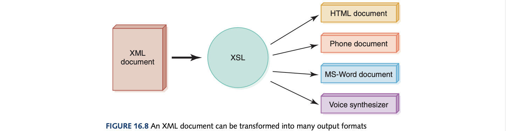

# Computer Science Illuminated Chapter 16 - The World Wide Web

## Introduction
**What is the difference between the World Wide Web (WWW) and the Internet?** The Internet is the infrastructure underneath that enables data to be sent to and from sources and their destinations using the TCP/IP protocols as a foundation. The World Wide Web is is the infrastructure of *information* and the network software used to access it. In other words, without the WWW we would be stuck sending files and emails to each other (no websites, webpages, IM, browsers, search engines, blogs - no fun interesting way to communicate our information). A *web page* is a document that contains or references various kinds of data. A *link* is a connection between one web page or another. A *website* is a collection of web pages, usually designed and controlled by the same person or company. We are not actually "visiting" a website but the resource we want is actually brought to us. A *web browser* is a software tool that retrieves and displays web pages (in the form of HTML files, talked about later). To specify a web address, a Uniform Locator Resource (URL) must be given which a standard way of specifying the location of a web page.  

## Search Engines
A web *search engine* is a site that helps you find other websites. It produces a list of candidate sites based on the inputted keywords by searching a database containing information about millions of websites. The two types of search are *keyword searching* and *concept-based searches* which use clustering to find candidate pages based on context regardless of text but this technique hasn't been perfected but has the potential to be better. 

## Instant Messaging (IM)
These applications allow you to send message to friends and coworkers in real-time. The leading IM application is AIM (AOL Instant Messaging) due to not being restricted to just AOL even though it is proprietary. However, they are not secure just like emails. 

## Weblogs
A *Weblog* or more commonly known as *blog* is a mechanism for publish periodic articles on a website. A website could be organised solely as a blog (such as this one) or is just one aspect of the site. In 2004, the Meriam-Webster Dictionary named "blog" as word of the year. This is due to the very same year, many bloggers exposing the forged documents used during the US presidential campaign which exposed CBS and Dan Rather. 

## Cookies
Cookies are a web-based technology that is a small text file that a web server stores on your local computer's hard disk. A website may store a key information about previous interactions in this file and is stored as name-value pairs plust the name of the site that stores the information. However, having multiple people use the same computer may make this information less specialised which is what they are used for. Even though cookies have not been embraced, the major misconceptions are that cookies are **not** programs and cannot execute anything and they cannot collect personal information about you or your machine. 

## HTML
*Hypertext Markup Language* (HTML) is the language used to create or build a web page. *Hypertext* refers to the fact that the information is not organised linearly. More accurately, the term would be *Hypermedia* due to the incorporation of images, audio and video. *Markup language* is a language that uses tags to annotate the information in a document. A *tag* is the syntactic element in a markup language that indicates how information should be displayed. Interestingly, two different browsers may interpret the same tag in different ways. An *attribute* is a part of a tag that provides additional information about the element such as 'src' in 'img' tag or 'href' in 'a' tag. 

## Interactive Web Pages
The major flaw in HTML is the information was static - there was no way to interact with the information and pictures presented. Many ways to solve this utilise the Java programming language due to its platform independence (I haven't seen the utilisation of these technologies since I was a kid and it makes me nostalgic).

### Java Applets
This is a java program designed to be embedded into a HTML document, transferred over the web and executed in a browser (on the user's machine). An applet is embedded into a html document using the \<APPLET\> tag and putting a java class file as its attribute and this can be run on any machine due to java being compiled to bytecode where the browser has an in-built interpreter for execution. However, this puts the burden on the client's machine. Also, the java language has a carefully constructed security model so applets cannot access local files or change any system settings since applets could be used to easily share malicious code. 

### Java Server Pages (JSP)
A Java Server Page (JSP) is a web page that JSP scriptlets embedded in it, where a JSP scriptlet is a portion of code embedded in a HTML document designed to dynamically contribut to the content of the web page. While not exactly the same as Java, JSP code resembles the general Java programming language and has the full expressiveness of a high-level programming language. This is also encased in special tags \<%\> where other tags can be put inside such as header tags to get the processed data and make it into a header. JSPSs are particularly useful for coordinating the interaction between a web page and its underlying database. 

### XML
Extensible Markup Language (SML) is a language that allows the user to describe the content of a document. It allows the creator to describe the web page's contents by defining their own set of tags as HTML doesn't specify what each piece of information represents only their formatting. XML is a *metalanguage* which is a language that is used to define other languages. Standard Generalized Markup Language (SGML) was the metalanguage used by Sir Tim Berners-Lee where XML is just a simplified version of this. The *Document Type Definition* (DTD) is a document that specifies the format and relationships among XML tags. The 'ELEMENT' tags show how each tag can be nested and its own attributes. The *Extensible Stylesheet Language* (XSL) can be used to transform an XML document into another format. 

