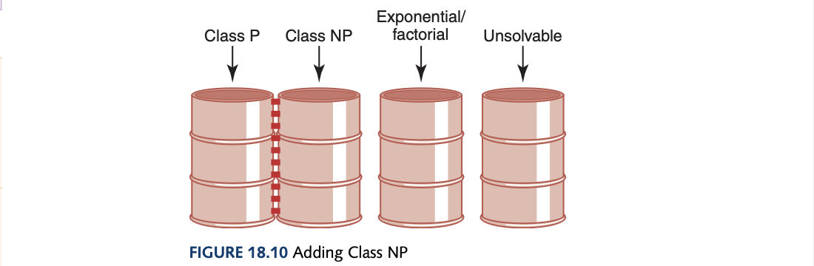

# Computer Science Illuminated Chapter 17 - Limitations of Computing

## Introduction
In all of this book we have looked at what computers *can* do but now we look at its limits regarding hardware, software, and the problems themselves. 

## Hardware
One factor that hardware limits computing is that numbers are infinite whereas, on computers they are finite. The limits on arithmetic for integer numbers is where there is a set limit to how many integers whether positive or negative can be represented which can easily be overshot. An example was given in Henry Walker's book, *The Limits of Computing* where he tells of the fable of the king and young dot-com'er. To represent such large numbers we could use a list of smaller numbers to represent parts of numbers and do the arithmetic on these list elements instead. For real numbers which consist of representing the digits and radix-point information, the *precision* of a number which is the maximum number of significant digits in an arithmetic operation could be larger than the *precision* of the machine and thus information is lost and erroneous results come from operations on real-numbers. For instance, converting -4,932,416 could lead to -4,932,000 based on 4 significant digits in our representation. A *representational (round-off) error* is an arithmetic error where the precision of the result of an arithmetic operation is greater than the precision of our machine. For example, $x=-1324 * 10^3$, $y = 1325 * 10^3$, and $z = 5424 * 10^0$: 
$$
(x + y) + z =>
1000 * 10^0 + 5424 * 10^3 = 6424 * 10^0
$$
However, the commutative law says $x + (y+z)$ should yield the same result:
$$
(y + z) + x =>
1330 * 10^3 + (1324) * 10^3 = 6000 * 10^0
$$

An *underflow* is the condition that occurs when the results of a calculation are too small to represent (it is valid to just use 0 as a substitute). An *overflow* is the condition that occurs when the results of a calculation are too large to represent but doesn't have a logical substitute. Another type of error is *cancellation error* where a loss of accuracy during addition/subtraction of numbers of widely differing sizes, due to limits of precision. For example, $(1 + 0.00001234 - 1) = 0.00001234$ but with 4 digits of precision we actually get 0.

There are also limits on components where The Titanic Effect rings true, "The severity with which a system fails is directly proportional to the intensity of the designer's belief that it cannot". For intercomputer and intracomputer data transfers, the limits on communication is where data can be corrupted during transit which can be mitigated by *error-detecting* and *error-correcting codes*.
- Parity Bits: Adds an extra bit to the byte which is 1 for the number of 1s in byte+parity_bit to be odd which is for *odd parity* and *even parity* is the same thing but the parity bit wants the number of 1s to be even instead. 
- Check Digits: A software variation of the same scheme that takes the units value of the sum of individual digits and store the unit's digit with the number. The number can still be corrupted and still display as not having an error due to coincidence so more positional values can be added of the sum of digits alongside the units value but there is a trade-off between complexity and accuracy. 
- Error-Correcting Codes: The ultimate redundancy is to keep two copies of each byte and if the parity is in error we check the digits of the second copy to determine the correct value. Of course, the worst case scenario would be if both values were corrupted. 

## Software
The problem with the amount of errors in software is not due to the lack of diligence in the software developers but due to the complexity of large-scale software systems. We will never be sure if we have found all the problems. The current approaches to software quality is adding *software requirements* which is a statement of what is to be provided by a computer system of software product and *software specification*, a detailed description of the function, inputs, processing, outpus, and special features of a software product; provides the information needed to design and implement the software. The software requirements is the what and the software specification is the how. The *software life cyele* is:
- Requirements
- Specifications
- Design (high-level and low-level)
- Implementation
- Maintenance

The two verification techniques are *walk-throughs* where a team performs a manual simulation of the program or design and *inspections* where one member of a team reads the program/design aloud line by line and the others point out errors. The following is a guideline for the number of errors per line of code that can be expected:
- Standard software: 25 bugs per 1000 lines
- Good software: 2 errors per 1000 lines
- Space Shuttle software: < 1 error per 10000 lines

C.A.R. Hoare used formal methods in successfully verifying the correctness of computer chips and the same could be done for programs using mathematical verification and proofing techniques as *formal verification*. The Open Source movement is also great in increasing the quality of software with the "benevolent dictator" of the project reading over with a peer review of fellow developers a change or improvement that gets incorporated into the next version. 

These are the most notorious software errors:
- AT&T down for 9 hours in January 1990 (due to break statement in C code)
- Therac-25, June 1985 - January 1987 (horrible software design)
- The Patriot, Feb 25 1991 (due to arithmetic rounding error)
- Gemini V (not taking into account Earth's rotation in design)
- Mars Climate Orbiter, October 1991 (failed translation of English units to metric)
- Mariner 1 Venus, July 1962 (due to typo)
- Ariane 5, June 4 1996 (overflow)

## Problems
To compare algorithms, you can take the difference between the start and end time of algorithms for comparison but this only proves it for that particular computer. For more general comparisons, we use *Big-O notation* which expresses computing time (complexity) as the term in a function that increases most rapidly relative to the size of a problem. The book likens the dominating term of the highest polynomial power akin to an elephant and the rest of the terms as goldfish due to going up to "large" N will make the smaller terms insignificant. The common orders of magnitude are:
- O(1) - bounded time (often called constant time, but the amount of work is not necessarily constant but is *bounded* by a constant)
- O($log_2N$) - logarithmic time
- O(N) - linear time
- O(N $log_2N$)
- O($N^2$) - quadratic time
- O($2^N$) - exponential time
- O(N!) - factorial time

Algorithms whose order of magnitude can be expressed as a polynomial (not exponential/factorial) in the size of the problem are called *polynomial-time algorithms*. All polynomial-time algorithms are defined as being in *class P* 

However, some problems are unsolvable which is a class of its own. Turing machines is a model which consists of a control unit with a read/write head that can read and write symbols from a defined alphabet on infinite tape. The *Church-Turing thesis* is that "anything that is intuitively computable can be computed by a Turing machine". The *Halting problem* takes a program *Example* as a program and data as NewProgram's input which then loops if it halts and loops if it halts, doing the opposite action. Feeding this into the original Turing machine of SolveHaltingProblem, it will always give the wrong answer meaning that there is at least one case. Therefore, any proposed solution must have a flaw. 

The classification of algorithms are made in bins. Exponential/factorial solutions are called *intractable* because for data of any size, they simply take too long to execute. *Class P problems* are problems that can be solved with one processor in polynomial time. However, utilising parallel processing some of these problems could be solved in polynomial time which is called *Class NP problems* which are problems that can be solved in polynomial time with as many processors as desired. Class P problems are in class NP problems. But the other way around? A speciall classed called *NP-complete problems* is part of class NP where the problems have the property that they can be mapped into one another where a polynomial-time solution with one processor can be found for one of the algorithms, it can be found for all of them. The image contains the bins as having dotted lines as they could be just one bin.

## Conclusion
In conclusion this book was great and what I originally went through in my university courses such as DBMS, one low-level course, and DSA course was quite similar to the information given and I did learn quite a new things especially in the communication layer (although I'm not a fan of Web development). i enjoyed the hardware layer and the OS layer and finally understand what an OS is and does. Overall, this book gave me a high-level impression of a variety of fields I am ready to tackle. In a way this book is a BFS of all CS concepts and my journey afterwards is a DFS of each concept given, starting with low-level programming and maybe leaning into electronics. I will start *Elements of Computing Systems* next. Thanks for reading!
