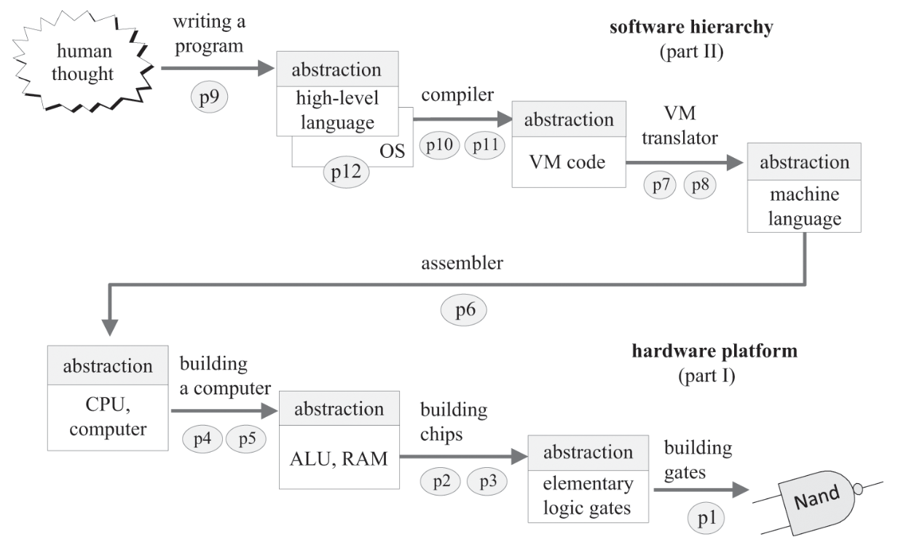

# The Elements of Computing Systems Chapter 1 - Boolean Logic

## Introduction
As this is the first chapter of the book, this section will include the preface, introduction, and my notes for the first chapter. The book I am using is the 1st edition from 2005. The scope of this book contains hardware, architecture, operating systems, programming languages, compilers, data structures and algorithms, and software engineering.

The image above contains the essential abstractions (the abstract interfaces) above their underlying implementations, all derived from NAND gates. This book has 3 main goals: how computers work, how to break complex programs into manageable modules, and developing large-scale hardware and software systems. Looking back on my life, I realise I have never made anything large-scale, whether it's a uni project or personal. A quote from Carl Rogers helps understand assimilation of true knowledge with depth, "*the only kind of learning which significantly influences behaviour is self-discovered or self-appropriated - truth that has been assimilated in experience.*"

The name of the game is abstractions! Everything in this book is an abstraction for further development of higher-level technologies and are taken as given. I don't think I have the necessary brain power or the tedious nature of recursively expanding out all the technologies from a high-level software on an operating system into its constituent parts all the way down to NAND gates. As mentioned in SICP: ideas can either be joined together to create compound ideas, comparing two ideas by setting them next to each other, and separating the idea from all others in its reality to create an abstraction of the idea. Abstraction is one of the three fundamental thinking patterns we have in reckoning with all our ideas and thoughts. Abstraction is everywhere but I have just recently learned what abstraction means and its powerful potential. All our technologies arise from us standing on the shoulders of giants which is another way of saying: using their abstracted ideas and putting our own on top. 

The high-level language section and the hardware section is split by a road that includes the translation process which are compilers, assemblers, and a virtual machine (VM) which is an intermediary between both translators - essentially what Bytecode is to Java. 

## Boolean Logic
Every digital device is composed of chips which are capable of many purposes but are made of general-purpose logic gates. A *Boolean function* is a function that operates on binary inputs and returns binary outputs which play a central role in the specification, construction, and *optimisation* of computer architecture. They can be represented as truth tables and Boolean expressions. The *canonical representation* is just the *sum-of-products* rule where given a truth table take all the inputs as itself if 1 or the negation if 0 then *AND* these all. For each row with a 1, *OR* these Boolean expressions to give a more direct translation from truth table to Boolean function and optimise from there. The number of Boolean functions defined over *n* variables are $2^{2^n}$. The *NAND* function can construct *AND*, *OR*, and *NOT* by itself only (same with *NOR*) and using the canonical representation every other Boolean function can be constructed.

A *gate* is a physical device that implements a Boolean function. Most gates are etched in silicon but other switching mechanisms other than transistors allow for magnetic, optical, biological, hydraulic, and pneumatic implementations. The real-life approach to implementing logic design is to use *Hardware Description Language* (HDL) so hardware designer do not need to build anything with their hands instead of creating complex chips and conducting empirical testing and having to tinker with its physical structure. A *HDL* definition consists of a *header* section and a *parts* section. 

The rest of the chapter goes into the APIs (specifications, chip name, and comments) on each of the gates needing to be implemented. The more interesting gates to be implemented are *multi-bit* versions which do some boolean operation on n-bit multi-bit arrays or commonly known as *buses*. For this specific computer, we are using a 16-bit architecture. *Multi-way* versions of basic gates accept an arbitrary number of inputs or Boolean variables which still retain its logic such as the *AND* gate only outputting 1 if **all** variables are 1. 

The theory and practice of constructions of gates and circuits are covered in standard textbooks about *digital design* or *logic design.* This book however does not cover optimisation methods such as building a gate with the least number of elementary gates or go over the implementation from a physics standpoints of the physical implementation of gates which each have its own characteristics (speed, power requirements, production cost, etc.).
