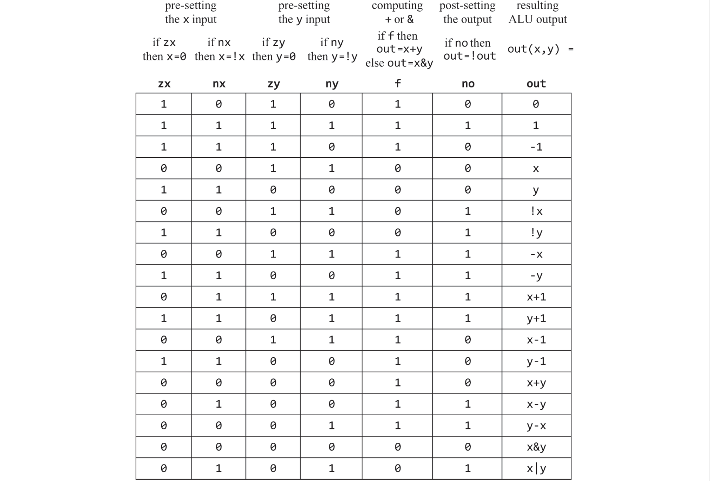

# The Elements of Computing Systems Chapter 2 - Boolean Arithmetic

## Introduction
Binary addition is one of the core operations while simple, runs deep in the operations of a computer. Most operations can be reduced to elementary additions of binary numbers. This chapter builds an ALU which able to execute arithmetic and logical operations.

## Binary Addition
In binary addition, the addition goes from right to left or from the *Least Significant Bit* (LSB) to the *Most Significant Bit* (MSB). If the last bit-wise addition generates a carry of 1, we say *overflow* has occured.

## Signed Binary Numbers
Signed binary numbers can be easily implemented by taking the $2^n$ different bit patterns for $n$ digits and separating these into two equal subsets. We do this by using the *2's complement* method where addition still works even with a different mapping of negative numbers. To figure out if overflow occured in 2's complement, check if addition between 2 positive or 2 negative numbers results in the carry bit into the MSB being different to the carry-out of the MSB.
$$
\begin{cases}
    2^n-x & ,x \neq 0 \\
    0 & ,\text{otherwise}
\end{cases}
$$

A neat property that gives it its name is $x + (-x)$ always sums to $2^n$ (or 1 followed by $n$ 0's). It can code a total of $2^n$ signed numbers where the maximal number is $2^{n-1}-1$ and the minimal number is $-2^{n-1}$. The code of all positive numbers begin with 0 and all negative numbers begin with a 1. To obtain $-x$ from $x$, leave all the trailing 0's and the first least significant 1 intact (from right to left), then flip all the remaining bits. An equivalent shortcut easier to implement in hardware is to flip all the bits of $x$ and add 1 to the result. Subtraction can be handled by using $x - y = x + (-y)$. 

## Adders
Half-adders are designed to add 2 bits. Full-adders are designed to add 3 bits. Adders are designed to add n bits. 

## Arithmetic Logic Unit (ALU)
The Hack ALU computes a fixed set of instructions $out = f_i(x,y)$ where x and y are the two 16-bit inputs, out is the 16-bit output, and $f_i$ is an arithmetic or logic function selected from 18 possible functions with 6 control bits (not all bit combinations are used only 18 are). The control bits are *zx, nx, zy, ny, f, no* where zx and zy zero the x and y value; nx and ny bit-wise negate; f is 2's complement addition or bit-wise AND; no is bit-wise negation of out. The table shows all the possible functions based on the control bits. For instance, x-1 is from x not being 0 or negated and hence is still $x$, and y is zeroed then negated which is -1 (111.. 16 times) and f is set to 1 and so they are added resulting in $x-1$.

The thought process that led to this design is listing all primitive operations wanted and used backward reasoning to figure out how x, y, and out can be manipulated to carry out the desired operations. The ALU uses only 6 control bits which is simple and elegant in its design.

**EXTRA:** no attempt on efficiency especially with long delays while carry bit propagates from LSB pair to MSB pair which can be solved by using *carry look-ahead* techniques.  
**EXTRA:** The overall functionality of the hardware/software platform is delivered jointly by the ALU and the OS that runs on top. Hardware implementations of arithmetic and logical operations are more costly but achieve better performance. This book uses ALU hardware of limited functionality where the operating system will take care of multiplication, division, and floating-point arithmetic.
