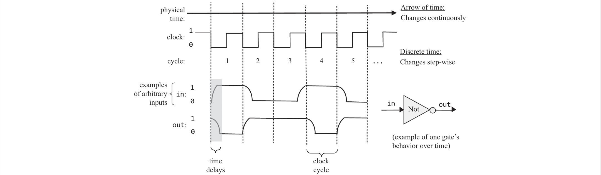

# The Elements of Computing Systems Chapter 3 - Sequential Logic

## Introduction
Sequential logic is to maintain state and introduces synchronisation, clocking, and feedback loops. This is ideal for memory usage. "Remembering something" is inherently time-dependent as committing something to memory is something you do *before* you remember it *now*. To do this, we must build some standard representation for the progression of time.

## The Clock
The passage of time is represented by a *master clock* that delivers a continuous train of alternating signals (based on an oscillator) which alternates between two phases 0/1, tick/tock etc. The elapsed time between the beginning of a "tick" and the end of the subsequent "tock" is called a *cycle* which models a discrete time unit. This master clock signal is broadcast to every sequential chip on the platform. The "tick" reads input and the "tock" emits the new output, hence one clock cycle consists of a read and write phase. 

## Flip-flops
The most elementary sequential circuit is called a flip-flop. We use a variant called a *data flip-flop* (DFF) which consists of a single-bit data input and a single-bit data output. There is also a clock input that continuously changes according to the master clock signal. The data and the clock inputs enable $out(t)=in(t-1)$ where $t$ is the current clock cycle which means that the DFF outputs the input from the previous time unit. At the beginning of each clock cycle, the DFF commit to their inputs from the previous time unit and at all other times is "latched" meaning that changes in their inputs have no immediate effect on their outputs. 

## Registers
A register is a storage device that can either "store" or "remember", implementing the behaviour $out(t) =  out(t-1)$ Since a DFF has the behaviour $out(t)=in(t-1)$, we could build a register from a DFF by feeding the output back into its input. However, you would need a multiplexer to choose between loading a new value in or cycling the output value back in. For n-bit registers, we form an array of n single-bit registers which holds multiple values where the *width* of a register is the number of bits it holds and *words* refer to the multi-bit contents of the register. To read the contents of a register, you simply probe its output and to write we load the new value into *in* and set *load* to 1, where in the next clock cycle , the register commits to its new value and starts emitting this new value as its output.

## Random Access Memory (RAM)
We can stack n-bit registers to form a *Random Access Memory* unit where RAM means that the requirements for the read/write operations happen  in constant time irregardless of physical location. This can be implemented by assigning a unique address value to each register and build a gate logic design that is capable of selecting the individual register and is done using logical means not in any physical sense of having "literal" addresses. The data *width* is the width of each one of its words and its *size* is the number of words in RAM. To read, *load* is 0 and the RAM's output immediately emits the value of the selected register an to write where *load* is 1, the selected memory register commits the input value in the next time unit where it will emit it after. It goes without saying that the *address* is also an input pin. 
### RAM Implementation
A memory bank of arbitrary length (power of 2) can be built recursively from smaller memory units where RAM64 can be made from 8 RAM8 modules and the address being *xxxyyy*, tells the unit that *xxx* is which RAM8 module to choose from and *yyy* is the address inside that RAM8 module which is then recursively going lower in the hierarchy until the single register level.   

## Counters
A counter is a sequential chip whose state is an integer number that increments every time unit, effecting the function $out(t) = out(t-1) + c$, where $c$ is typically 1. Counters are used in *program counters* whose output is interpreted as the address of the next instruction to be executed. 
### Counter Implementation
It can be equipped with additional functionality such as resetting, loading a new counting base, and the ability to decrement. Being able to set the counting base is analogous to the instruction saying "jump to instruction number n" which is used in low-level machine language..  

## Time matters
A sequential chip is a chip that embeds one or more DFF gates, either directly or indirectly. Sequential chips have the ability to either maintain state (memory) or operate on state (counters). This is done by forming feedback loops. 

### Combinational vs Sequential Chips
- In combinational chips, time is neither modeled  nor recognised which causes the introduction of feedback loops to be faulty since the output and input would depend on each other, becoming a "data race". For sequential chips, feedback loops work since the output at time $t$ does not depend on itself but rather on the output at time $t-1$.

$$
out(t)=in(t) \quad \text{vs.} \quad out(t)=in(t-1)
$$

- In combinational chips, the outputs change when their inputs change, irrespective of time. Sequential chips ensure that outputs change only at the point of transition from one clock cycle to the next and not within the cycle itself. Sequential chips are allowed to be in *unstable* states during the cycle, requiring only at beginning of the next cycle they output correct values. Sequential chips cange output when time changes, even if no inputs changed. 
- Combinational chips have no synchronisation. The "discretisation" of sequential chips allows for synchronising the overall computer architecture. This is illustrated by an ALU adding $x+y$ where $x$ is in a local register and $y$ is in a remote RAM register. The ALU will get x much faster but the value of $y$ may have changed before reaching it, based on distance, resistance, interference, random noise, etc. This is already solved, since the output of the ALU is always routed to a sequential chip but we have to ensure the computer's clock cycle is slightly longer than the time it takes a bit to travel the longest distance from one chip to another. From this, we are guaranteed that by the time the sequential chip updates its state, the inputs that it receives from the ALU will be valid.  
