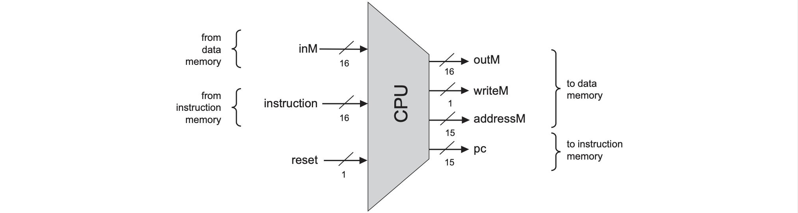
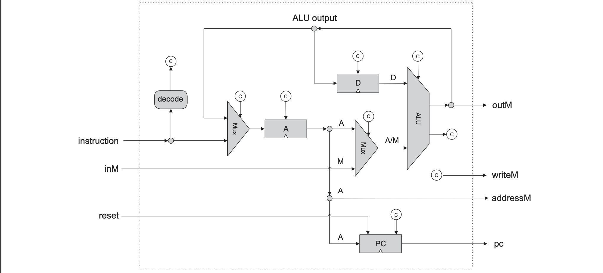
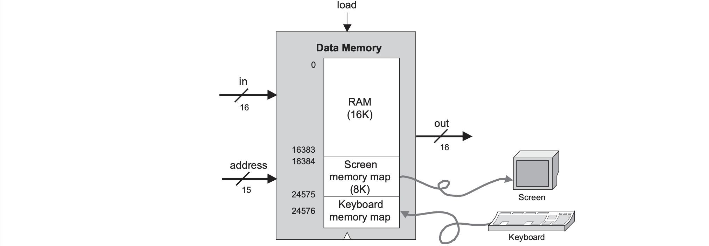
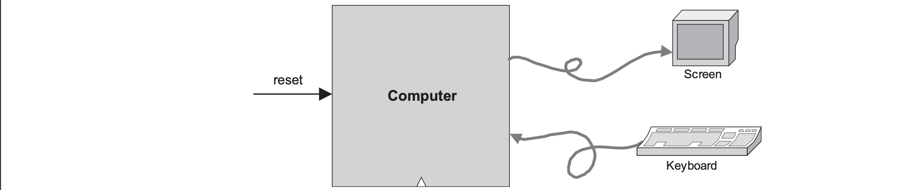

# The Elements of Computing Systems Chapter 5 - Computer Architecture

## Introduction
This chapter combines all the chips created in chapters 1 to 3 to create a machine capable of running the machine language instructions from chapter 4. 

## General Computer Architecture
### Stored Program Concept
A general-purpose computer is a machine with finite hardware capable of an infinite array of tasks - this is based on the *stored program concept* and is the foundation for modern computer science. It is when the program's code is stored in the memory alongside its data which is known as "software".Before the 1930s, mechanical computers had their logic embedded in the hardware unable to be changed. 

### von Neumann Architecture
The von Neumann architecture is not the same as the *stored program concept* but uses the *stored program concept* as a key element. The von Neumann architecture is a conceptual blueprint for almost all modern day computers including: CPU, memory device, input device, and output device. Here, the memory device stores both program instructions and its data.

#### Memory
The memory of a von Neumann machine holds two types of information: data items and programming instructions. High-level programs manipulate variables, arrays, and objects which are translated into machine language - becoming a series of binary numbers stored in data memory. It can be read and written to. The instructions however, translated into machine language becomes a series of binary words stored in *instruction memory*. In each step of the computer's operation, the CPU fetches a word from instruction memory, decodes it, executes it, and figures out what instruction to execute next.

#### CPU
The CPU carries out various calculations, reads and writes values from and into the memory, and to conditionally jump to execute other instructions. It is composed of the ALU (performs arithmetic and logical operations and test conditions), registers (designed to carry out simple calculations quickly), and the *control unit* which decodes the word to signal various hardware devices to execute the instruction and figures out which instruction to fetch and execute next. Registers come in different flavours: *data registers* holds some data value, *addressing registers* holds some address especially if the address is part of the execution of a previous instruction, and *program counter register* which holds the next instruction that must be fetched (either incremeneted or from a goto directive). 

#### I/O
Computer scientists have devised standards so the myriad of I/O devices look exactly the same to the computer. This is called *memory-mapped I/O* which allocates an exlusive area of in memory as its "memory map" and values can be written to it such as writing to a screen or read from it such as probing from a screen. Each I/O device is required to define an interaction contract so programs can accesss it correctly. Whenever we want to connect a new I/O device, all we do is allocate it a new "memory map" and note its base address (these one-time configurations are typically done by the OS). 

## Hack Computer Architecture
The Hack platform is a 16-bit von Neumann machine consisting of a CPU, two separated memory modules serving as instruction memory and data memory, and two memory-mapped I/O devices for a screen and keyboard. This will run the same machine language specified in chapter 4. The program counter (PC) chip is connected to the address input of the ROM chip (pre-burned with instruction memory) so the ROM chip always emits $ROM[PC]$ or the contents of the instruction memory location whose address is pointed at by the PC. This value is called the *current instruction*. 

Each clock cycle consists of *Execute* where various bit parts of the current instruction are fed to various chips in the computer whether it's an A-instruction or C-instruction and *Fetch* where the instruction to fetch next is determined by the jump bits in the current instruction and the ALU output.

### CPU and ALU Specification
The CPU implementation is to create a logic gate architecture cap able of executing a Hack instruction and fetching the next instruction to be executed. The *control logic*  is responsible for *instruction decoding* which figures out what the instruction means, *instruction execution* which signals the various parts of the computers what they should do, and *next instruction fetching* which figures out which instruction to execute next.

### Data Memory Implementation
The Hack instruction memory is implemented in a direct-access 32K ROM which is given. The data memory is a typical RAM device where reading the contents is combinational where the output is emitted instantly and writing to memory is sequential where the start of the next cycle is when the new value will be output. The data memory is for storing data and interfaces between the CPU adn the I/O devices with *memory maps*.

### Computer Chip

## Perspective
Typical computer platforms have more registers, data types, more powerful ALUs and richer instruction sets. However, Hack is quite similar qualitatively, following the same conceptual von Neumann paradigm. *General-purpose* computers are designed to easily switch from one program to another whereas, *dedicated computers* are usually embedded in other systems and a single program is burned into the dedicated ROM. However, both have the same architectural ideas. 

Most *general-purpose* computers use a single address space for storing both data and instructions (no separate ROM and RAM). The instruction address and the optional address specified by the instruction must then fed into the same destination: the address input of the shared address space (one address input for RAM module). This cannot be done at the same time so the solution is to use two-cycle logic where the *fetch cycle* which feeds the instruction address first where the RAM emits the current instruction which is stored in the *instruction register* and the *execute cycle* decodes the instruction and the optional data address can be used into the memory's address input.

Hardware architecture courses usually evolve around: 
- implementing memory hierarchies (cache)
- better access to I/O devices
- pipelining
- parallelism
- instruction prefetching

To enhance the processor's performance there are two main schools of hardware design *Complex Instruction Set Computing* (CISC) which argues doing this by providing rich and elaborate instruction sets and *Reduced Instruction Set Computing* (RISC) argues doing this by using simpler instruction sets to promote as fast a hardware implementation as possible. 

In order to make my own computer, I will add a separate control unit, optimisation techniques for some special domain (thinking linear algebra at the moment), and my own custom domain-specific assembly language.
