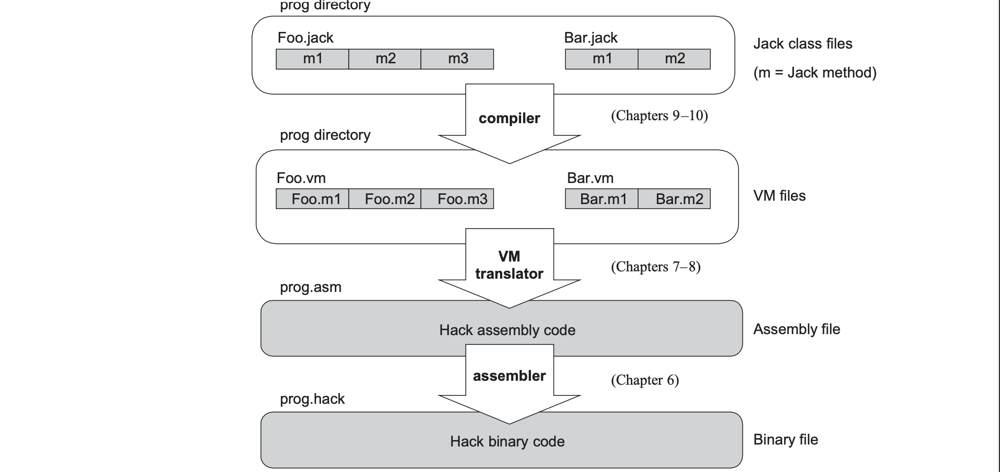

# The Elements of Computing Systems Chapter 7 - Virtual Machine I: Stack Arithmetic

## Introduction
This chapter describes building a compiler for a typical object-oriented language with a two-tier translation model where the compiler compiles to this intermediate code (in chapters 10 and 11) and in this chapter and the next, the code is compiled to assembly and then machine code. This idea goes back to the 1970s. Instead of running on a real plaform, the intermediate code is designed to run on a *Virtual Machine* (VM) and this chapter is modelled after the JVM paradigm. The VM language presnted consists of arithmetic, memory access, program flow, and subrouting calling commands. This chapter focuses on arithmetic and memory access commands.

## Virtual Machine Paradigm
*Compilation* between a high-level language to the computer's machine language requires many different types of compilers for each combination of high-level language and machine language. To decouple this, we can break the compilation process into two stages: high-level program translated to intermediate and intermediate language translated to machine language (in this chapter we translate to assembly and then use an assembler). This is appealing since the decouping means the first stage only depends on the details of the high-level language and is the same in the second stage for machine language. 

### Why is a VM language beneficial?
- Compilers for different target platforms can be obtained by replacing the virtual machine implementation which allows for code to be transportable across different hardware platforms. 
- Compilers for many languages can share the same VM backend allowing for code sharing and language interoperability.
- Modularity: every improvement in efficiency of VM implementation is inherited by all compilers above it. 

To implement this, we are using a *stack machine* model where you pop operands from top of stack and push their results back onto the top of the stack. Surprisingly, any high-level language program can be implemented in a stack.

## VM Specification

To implement this, all arithmetic commands are either bivariate (taking in top two values of stack and doing operation) or univariate (taking top stack value and doing operation). For memory access, *argument*, *local*, *static* are for the arguments, local variables, and static variables of a defined function respectively, which is the focus on the next chapter. *this* and *that* are just general-purpose segments on the heap which store data (indexed contiguously in order for arrays or objects) and *pointer* points to the base address of the *this* (pointer 0) and *that* (pointer 1) base address. The first 5 RAM addresses just point in the RAM where their base addresses are which is based on the standard mapping given which tells us what addresses are valid to store certain data such as *stack* or *heap*.
### Array Handling
For arrays, you just push the base address through *local* virtual segment and add that with the index you are trying to get, stored as an offset from the base address. Popping this value into the pointer 0 or 1, you can pop some value on the top of the stack at that moment onto *this* or *that*. *local* is already given from high-level compilation to intermediate VM.

### Object Handling
Physically, the data of each object instance is serialised on RAM as a list of numbers representing the object's field values which is quite similar to arrays. To do this, just push some *argument* and pop that into *pointer*  0 or 1 and just *pop* the top value of the stack to *pop this n* where n is the index where field is stored offset from the instance's base address. *argument* is already given from high-level compilation to intermediate VM.
