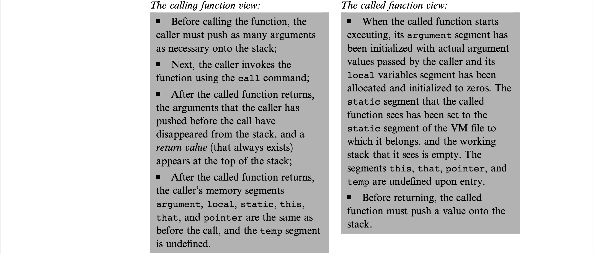

# The Elements of Computing Systems Chapter 8 - Virtual Machine II: Program Control

## Introduction
High-level languages support the power of expression (of user-defined functions) creating programs in algorithmic thought rather than expressing low-level machinations at the hardware level. To do this, the low-level implementation must manage the *calling* subroutine and the *called* subroutines. The low-level implementation must manage:
- Passing parameters from caller to called subroutine
- Saving state of the caller before switching to execute the called subroutine
- Allocating space for local variables of the called subroutine
- Jumping to execute the called subroutine
- Returning values from the called subroutine to the caller
- Recycling memory space by the called subroutine, when it returns
- Reinstating the state of the caller
- Jumping to execute the code of the caller immediately following the spot where we left it

## Program Flow
In low-level programming, branching is done by instructing the machine which instruction to execute at some other destination but the next instruction. This is done unconditionally by a *goto* command and conditionally on the top value of the stack by an *if-goto* command. 

## Function Calling 
Each programming language is characterised by a fixed set of built-in commands. The key abstraction mechanism provided by modern languages is the ability for the programmer to define their own operations. In *procedural* languages, they are called *subroutines*, *procedures*, or *functions* and in *object-oriented* languages they are called *methods*. The uniformity of the function calling protocol which is the setting up of arguments, both operators whether built-in or user-defined are expected to remove their arguments from the stack and are expected to return a value to the top of the stack. Both types of commands (user-defined and built-in) have the same feel so the programmer can use these intertwined in their programs and provides vast expressive power through abstraction. 

Subroutines can be call other subroutines or itself as recursion, yet the memory must be somehow managed for this. Although the subroutine calling chain can be arbitrarily deep, the subroutine at the top of the stack is the one being executed and the subroutines lower on the chain is waiting for the above's returned value. This LIFO model lends itself perfectly well to the stack which was already being used as a fundamentally LIFO data structure. We can push the *frame* - the subroutine's local variables, its arguments, its working stack, and the other memory segments that support its operation - of the caller onto the stack saving its state and branch to execute the called subroutine and once returned, we pop the caller's world inside the frame and continue executing it.

Subroutines are inherently anonymous meaning commands like *power(x,y)* or *sqrt(x)* are designed to serve **ANY** caller, so the return address cannot be a part of their code. Hence, the return address should be the address saved as part of the caller's world which points to the address of the command directly after the called subroutine was called. 

Each VM function that starts running, assumes that it is surrounded in its own private world. The agent responsible for this *virtual* worldview is the *VM implementation* not the VM itself.

## Implementation
The entry point of the program calls upon ROM address 0 which is the *bootstrap code* which is the first thing executed when the computer boots up. We set the SP (stack pointer) at 256 and *call Sys.init* which calls the main function of the main program and enter an infinite loop upon completion. For instance, the JVM executes Foo.main method for class Foo and in Jack it is the *main method* of the *Main class*.

**NOTE:** Push the arguments for the called subroutine *before* calling the subroutine. 

## Perspective
One implementation option used by Java and C# is the stack-based model. Other compilers handle the details of subroutines directly, without using a VM such as in the hardware or using a VM but not for subroutine calling. 
