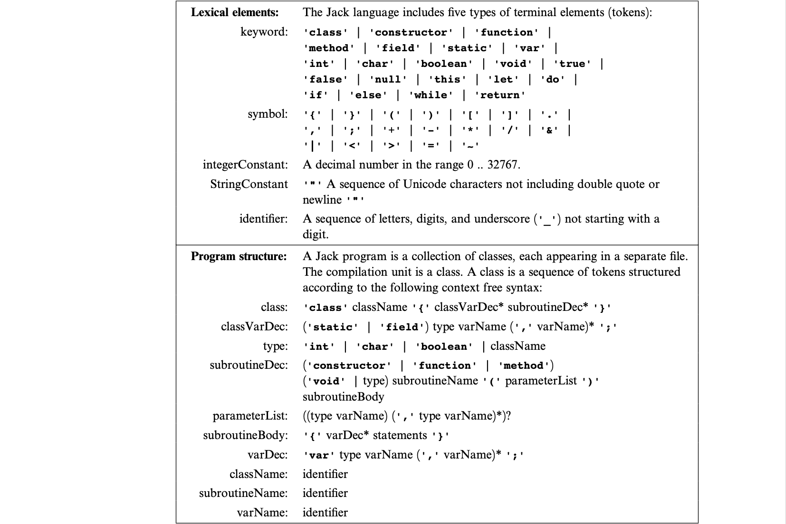
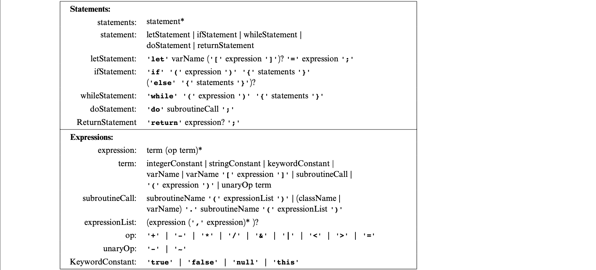

# The Elements of Computing Systems Chapter 10 - Compiler I: Syntax Analysis

## Introduction
A compiler is a program that translates programs from a source language to a target language. This is based on two distinct tasks: *synatx analysis* (this chapter) and *code generation*. Writing a compiler requires knowledge in *language translation and parsing techniques*, *data structures* such as trees and hash tables, and applying recursive compilation algorithms. 

**Why build a compiler?**
The same types of rules and grammars used for describing programming languages is also used for specifying the syntax of data sets such as in computer graphics, DBMS, communications protocols, and bioinformatics. Hence, learning how to parse a language can be extrapolated to other domains that require parsing some other data under some rules/grammar.

## Background
The *syntax analysis* task can be split into two tasks: *tokenizing* and *parsing*. Tokenizing is a grouping of input characters into language atoms and parsing is attempting to match the resulting atoms stream (from tokenizing) to the syntax rules of the underlying language (this also checks the input text's validity). These tasks are independent of the target language and can thus be modularised apart from the code generation capabilities. The job of the *syntax analyser* is **understanding the structure of the program.** 

### Lexical Analysis
The first step is to group the sequence of characters into *tokens* as defined by the language syntax - ignoring white space and comments. *Lexical analysis* is also called *scanning* or *tokenizing*. The tokens are viewed as basic atoms and the stream becomes the main input to the compiler.

### Grammars
After *lexical analysis*, we must now focus on how to group the tokens into language constructs.This can be done by attempting to match the tokens stream on some predefined set of rules called a *grammar*. Almost all *formal languages* (includes programming languages), can be specified using formalisms known as *context-free grammars* - a set of rules specifying how syntactic elements in some language can be formed from simpler ones (recursive!). The grammar specifies allowable ways to combine tokens which are called *terminals* (low-level tokens that require not further parsing) and the high-level *non-terminals*. 

Recursive parsing algorithms are simple and elegant but a key complication arises when there are several alternatives for parsing *non-terminals*. *LL(0) grammars* solve this by stating: the **first token** suffices to resolve without ambiguity which rule to use next. In the parsing of expressions here, the first token may not suffice so a *"look ahead"* to the next token will be needed.

### Parsing
Parsing is **checking whether a grammar "accepts" an input text as valid.** This is an exact correspondence between the text and the rules of the grammar. Since the grammar rules are hierarchical, the output generated by the parser can be described as a *parse tree* or *derivation tree*. A side effect is that the input text's entire structure is unraveled . Some compilers represent this as an explicit tree data structure handling more complex code generation and error reporting. This compiler represents this structure implicitly and generates the code and reports errors line by line. 

## Jack Language Grammar

## Perspective
The parsing algorithm described runs "on-line"; it parses the input as it reads it and does not keep the entire input program in memory. This is a top-down strategy whereas, other algorithms may save the input program in memory in some data structure and can use a bottom-up strategy which is much more complex. Some extensions could be learning *formal languages* theory and *computational linguistics*. Syntax analysers are rarely written from scratch and are not stand-alone programs. Programmers build tokenizers with *LEX* and parsers with *YACC* which are "compiler generator" tools. As input, they take a context-free grammar and output syntax analysis code capable of tokenizing and parsing programs written in that grammar. 
