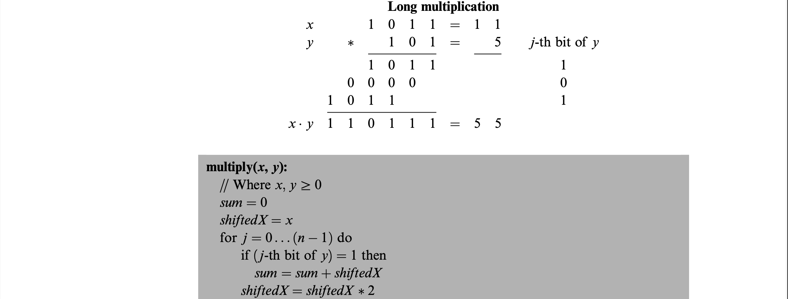
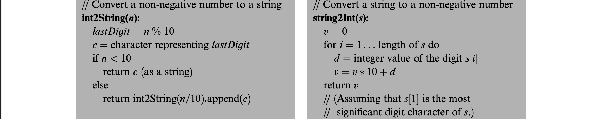
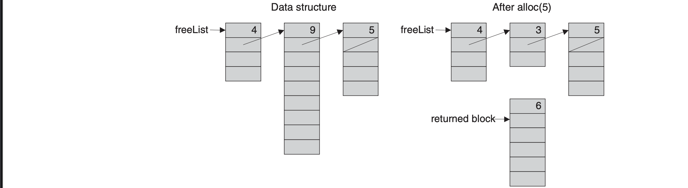
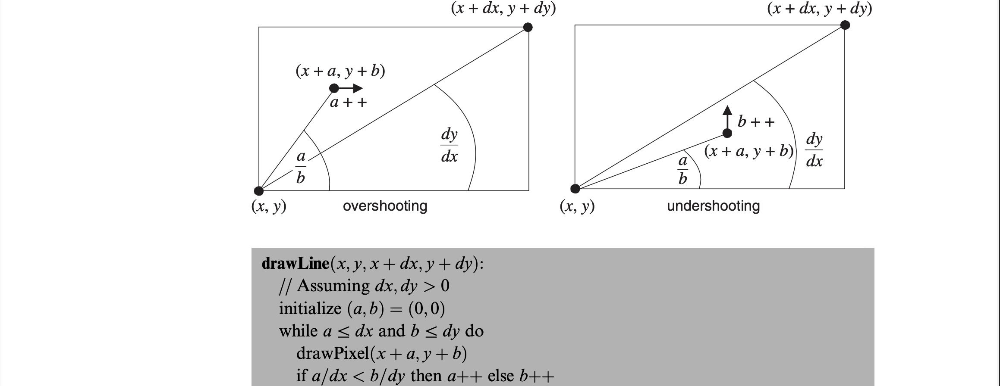
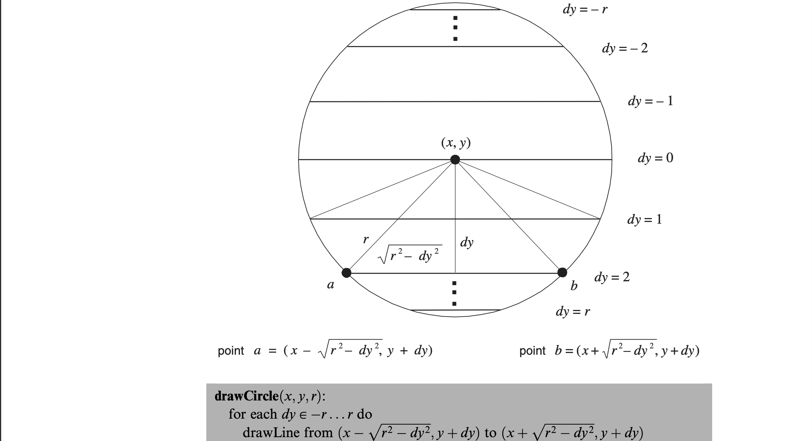

# The Elements of Computing Systems Chapter 12 - Operating System

## Introduction
The operating system (OS) is designed to close the gaps between software and hardware and make it more accessible for programmers and users. High-level programmers do not want to worry about the memory-mapped RAM for printing or drawing something to the screen, for instance. The OS here is quite minimal and encompasses:

- encapsulating various hardware services in a software-friendly way
- extending high-level languages with various functions and abstract data types (more like standard library)

Many modern programming languages, such as Java, pack many classic OS services in its standard software library such as GUI management, memory management, and multitasking. The OS is packaged as a collection of Jack classes and each providing a set of services through subroutine calls. The OS, unlike other high-level programs, must be aware of the hardware platform on which it runs to hide the underlying details of the hardware to the user.

## Algorithms

### Mathematical Operations
A lot of the algorithms here could have been implemented on hardware depending on cost/performance requirements. For Jack, these operations of multiplication and division will be handled in software at the OS level. 

For efficiency of algorithms, we want the running time to be proportional to the parameter *n*, where *n* is the length of the numbers in bits. Algorithms that are proportional to the *value* of the numbers instead are unacceptable, since these algorithms run *exponentially*. A naive multiplication algorithm (repeated addition) for a 64-bit number can run for years since the number can loop until 18 billion billion under 64 bits ($2^n$).

#### Multiplication
The algorithm here is running in O(n) and considers the process of multiplication taught in elementary school. If *y*'s bit has a 1 *x* is added and then shifted to the next place value. The shifting can either be done by a left-shift or just addding *shiftedX* to itself.

#### Division
For the naive implementation of repeated subtraction, this is dependent on the value of *y* and may be as large as O(x). This algorithm is recursive and works by subtracting the largest number that can fit into the dividend *x*. The recursion depth is still by bound by *n*, where *n* is the number of bits in *x*, since *y* is multiplied by 2 each recursion depth until it is greater than *x* which happens once *y* is left-shifted enough where it is greater than *x*'s n bits. 

#### Square Root
Square roots can be computed much more efficiently using the *Newton-Raphson method* or a *Taylor series expansion*. The simpler algorithm that is used here is the binary search since $y=\sqrt{x}$ is monotonically increasing and its inverse function $x = y^2$ can be computed easily through our previous implementation of multiplication. 

### String Representation of Numbers
From the ASCII code, all you have to do is subtract 48 from the characters '0' to '9' to get their literal integer values, and vice versa.

### Memory Management
Programmers don't have to worry about the details of allocating RAM space to these variables and then recycling the space when it is no longer needed. *static* variables are allocated by the compiler at compile time and *local* variables are allocated on the stack each time a subroutine calls. Other memory is dynamically allocated during the program's execution. For example, in Java, if a program creates a new array or object, a memory block **whose size can only be determined at run-time is allocated.** For languages like C++ and Jack, de-allocation of un-needed space is the responsibility of the programmer, whereas in Java there is *garbage collection*. The RAM segment where *dynamic memory allocation* occurs is the *heap*.

#### Basic Memory Allocation Algorithm
This algorithm manages a single pointer called *free* which points to the beginning of the heap segment which has not been allocated. This algorithm is wasteful since it does not reclaim the space of decommisioned objects.

#### Improved Memory Allocation Algorithm
This algorithm manages a linked list of available memory segments called *freeList* where each segment contains two housekeeping fields: segment lengh and pointer to the next segment which are kept in the first two memory locations. When allocating a memory block, there are two heuristics *best-fit* and *first-fit*, and once found the required memory block is taken from it. This segment is then updated in the *freeList*, becoming the part that remained after allocation. If no memory left or the segment is too small, the segment is eliminated from *freeList*. When reclaiming memory, the algorithm appends the de-allocated block to *freeList*. After some time, this may cause a block fragmentation problem and some "defrag" operation should be considered. This can be done by some ad-hoc condition such as every time an object is de-allocated, alloc() fails etc. 

### Variable-length Arrays and Strings
We use a String class that uses arrays as its underlying data structure and keep track of the String's length and the length of the memory block (maximum length or end of array).

### Input/Output Management
An important function of the OS is handling various I/O devices which is done by encapsulating the details of interfacing the device and by providing convenient access to its basic functionality, using a set of O/S routines called the *device driver*. 

#### Graphics Output
Most computers use *raster* or *bitmap* screens where you draw to an individual pixel. If the screen interface is based on a RAM-resident *memory map*, drawing a pixel is done by setting the proper binary value in its corresponding RAM location. 

To draw a general-purpose line, you must take care of the differences between the x values *dx* and *dy* where *dx,dy < 0*; *dx > 0, dy < 0*; *dx < 0, dy > 0*. The first algorithm uses division but the second cleverly converts this into an algorithm that doesn't use division or multiplication. This is done by replacing $\frac{a}{dx} < \frac{b}{dy}$ with $a \cdot dy < b \cdot dx$ which is replaced by $(a \cdot dy - b \cdot dy) + dy$ when a is incremented and the same can be done for b. 

To draw a circle, draw a series of horizontal lines one for each row in the range of $y \pm r$. However, this algorithm is inefficient since it uses the square root operation.

#### Character Output
For character output, we have to divide the screen which was in pixels into something more character-oriented. For Jack's screen of 256x512, allocating a grid of 11\*8 pixels for a single character will mean we can show 23 lines of 64 characters each (with 3 row of pixels left). A bitmap must be designed but for the project is already given in the form of an array of length 11 where each element's bit value represents a row where 1 is black and 0 is white. Furthermore, each *character bitmap* should have at least a 1-pixel gap before the next character and adjacent lines. Furthermore, a cursor objet that keeps track of the screen location should be drawn and its information consists of line and column counts. When the bottom of the screen is reached, the options could be "scrolling" or resetting to the top-left corner.  

#### Keyboard Handling
The low-level implementation is not trivial since this involves an unpredictable event: human input. The program gets data directly from the memory-mapped address of the hardware that is continuously refreshed, if it's a *memory map*. Hence, to determine if a key is pressed, one has to return the ASCII value from the RAM location or return 0 for no key pressed. For reading a single character, you set up while loops to do nothing before and after a key is pressed. This is because the elapsed time between "key pressed" and "key released" events is unpredictable and their effects should be neutralised. For reading a string, you just do the readChar() function until a newline character is returned or a backspace character (which doesn't exit the loop). 

#### Sys
The entry point of the OS and programs is Sys where Sys.init calls the init functions of all other classes to set them up before needing to be used in the program where it calls "Main.main()".

## Perspective
The basic services included in this OS: memory management, driving I/O, handling initialisation, supplying mathematical functions not found in hardware, and implementing data types like *string* abstraction. However, ths OS lacks mult-threading and multi-processing support, no mass storage devices (no file system abstraction), no interface (command line or graphical), security, communication, etc. The OS code in most computers is "privileged" where the hardware platform forbids the user code from executing operations exclusive to the OS. Further programming languages wrap these services in regular functions or methods. In the Hack platform, there is no distinction between OS and user code. The algorithms require O(n) addition operations  but since there are two n-bit numbers which require O(n)-bit operations (gates in hardware), these algorithms end up requiring O($n^2$)-bit operations. There exists algorithms with greater optimisation for a larger number of bits, especially for the geometric operations which are implemented in special graphics acceleration hardware.

## Experience
Unfortunately, due to the same time constraints of last chapter, I only had one day to work on this which was on the 20th of December. I found I could do well in understanding the pseudocode but could not implement the screen, output, and memory classes to completion. However, I have learned quite a bit, especially in the hardware sections, assemebler, and VM implementations. I am quite far away from making my own machine and still have limited understanding in GPUs and device drivers. I will take a break from computer architecture and focus on multivariate statistics and linear algebra for the time being, but what comes after I do not know. I am thinking either further dives into computer architecture or low-level programming.
