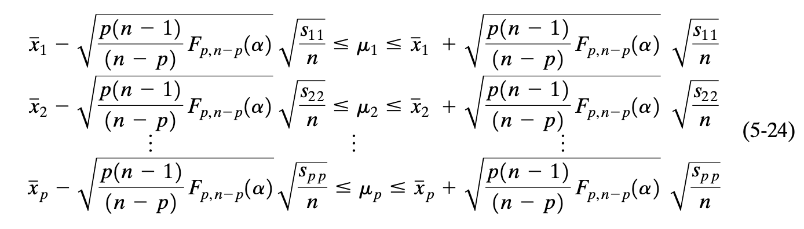

## Introduction
This chapter showcases ways to make statistical inferences based on the sample mean vector whereas, the next chapter will be about comparing multiple means to make inferences. 

## The Plausibility of $\mu_0$ as a Value for a Normal Population Mean
If we want to know if our mean is statistically significant enough to be considered as a normal population mean, we must test and construct a hypothesis test. Hypothesis testing is a test of the competing hypotheses: *null hypothesis* and *alternative hypothesis*. In the multivariate case, instead of using $t^2$, the $T^2$ distribution is used where,
$$
T^2 = n(\bar{X} - \mu_0)^TS^{-1}(\bar{X}- \mu_0)
$$

which is eerily similar to the squared distance from our sample mean to the null hypothesis in squared distance units. We also do not require special tables for the $T^2$ distribution as it can be expressed as part of the $\frac{(n-1)p}{(n-p)}F_{p, n-p}$ distribution. We can set this up as a probability expressing,
$$
\alpha = P[n(\bar{X} - \mu_0)^TS^{-1}(\bar{X}- \mu_0) > \frac{(n-1)p}{(n-p)}F_{p, n-p}(\alpha)]
$$
, where $F_{p, n-p}(\alpha)$ is the upper $(100\alpha)th$ percentile.

An analogy emerges between the univariate $t^2$ and the multivariate $T^2$:
$$
T^2_{p, n-1} = \left(\text{multivariate normal random vector}\right)^T\left(\frac{\text{Wishart random matrix}}{d.f.}\right)^{-1}\left(\text{multivariate normal random vector}\right)
\\
t^2_{n-1} = \left(\text{normal random variable}\right)^T\left(\frac{\text{scaled chi-square random variable}}{d.f.}\right)^{-1}\left(\text{normal random variable}\right)
$$

Another property of the $T^2$-statistic is its invariance to linear transformations $Y=CX+d$, where $C$ is non-singular (an inverse exists).

**Proof:**
$$
\bar{y} = C\bar{x} + d
\\
S_y = \frac{1}{n-1}\sum_{j=1}^n(y_j-\bar{y})(y_j-\bar{y})^T=CSC^T
\\
\mu_y = E(Y) =E(CX+d) = E(CX) + E(d) = C\mu + d
\\
T^2 = n(\bar{y} - \mu_{Y,0})^T S_y^{-1}(\bar{y}-\mu_{Y,0})
\\
T^2 = n(C(\bar{x} - \mu_{0}))^T (CSC^T)^{-1}(C(\bar{x} - \mu_{0}))
\\
T^2 = n(\bar{x} - \mu_{0})^TC^T (CSC^T)^{-1}C(\bar{x} - \mu_{0})
\\
T^2 = n(\bar{x} - \mu_{0})^TC^T(C^T)^{-1} S^{-1}C^{-1}C(\bar{x} - \mu_{0})
\\
= n(\bar{x} - \mu_0)^TS^{-1}(\bar{x}-\mu_0)
$$
Hence, from the above proof, we can write a linear combination in terms of the original variables.

## Hotelling's $T^2$ and Likelihood Ratio Tests
The Hotelling's $T^2$ test is an example of a *likelihood ratio method* and the $T^2$-statistic can be derived as the likelihood ratio of $H_0: \mu = \mu_0$. We want to compare the likelihood of the null hypothesis compared to an unrestricted likelihood of the $\mu$ parameter to see if $\mu=\mu_0$, the null hypothesis, is plausible.
$$
\max_{\mu, \Sigma} L(\mu, \Sigma)=\frac{1}{(2\pi)^{np/2}|\hat{\Sigma}|^{n/2}}e^{-np/2} 
\\
\text{this result is based on } \mu \text{ being } \bar{X} 
\\
\max_{\Sigma} L(\mu_0, \Sigma) = \frac{1}{(2\pi)^{np/2}|\hat{\Sigma}_0|^{n/2}}e^{-np/2} 
\\
\mu \text{ is not part of the parameters since it is fixed to } \mu_0
\\
\text{Likelihood ratio} = \Lambda = \frac{\max_{\Sigma}L(\mu_0,\Sigma)}{\max_{\mu, \Sigma} L(\mu, \Sigma)} = 
\left(\frac{|\hat{E}|}{|\hat{E}_0|}\right)^{n/2}
$$

An equivalent statistic is *Wilks' lambda* $\Lambda^{2/n} = \frac{|\hat{\Sigma}|}{|\hat{\Sigma}_0|}$

### General Likelihood Ratio Method
The general likelihood ratio method considers $\theta$, a vector consisting of all the unknown parameters and $\Theta$ being the entire parameter set. The likelihood function of $L(\theta)$ is just evaluating the joint density of $X_1, \ldots, X_n$ at their observed values. The null hypothesis is $H_0: \theta=\theta_0$ which is restricted to lie in the subset $\Theta_0$ of $\Theta$. 
$$
\Lambda = \frac{\max_{\theta \in \Theta_0}L(\theta)}{\max_{\theta \in \Theta}L(\theta)} < c
$$

We reject $H_0$ if the maximum of the likelihood obtained by allowing $\theta$ to vary over $\Theta_0$ is much smaller than the maximum of the likelihood obtained by varying $\theta$ over all $\Theta$ values.

## Confidence Regions and Simultaneous Comparisons of Component Means
This is just extending the univariate concept of a confidence interval to the multivariate confidence region. **A confidence region is a region of likely $\theta$ values.**
$$
P[R(X) \text{ will cover the true }\theta] = 1 - \alpha \text{, covering } 100(1- \alpha)\%
\\
\text{which is the same as saying,}
\\
n(\bar{x}-\mu)^TS^{-1}(\bar{x}-\mu) \le c^2 = \frac{p(n-1)}{(n-p)}F_{p, n-p}(\alpha)
$$

This is a confidence ellipsoid, where beginning at $\bar{x}$ the axes are $\pm \sqrt{\lambda_i} \sqrt{\frac{p(n-1)}{n(n-p)}F_{p, n-p}(\alpha)e_i}$

### Simultaneous Confidence Statements
Confidence region assesses the entire mean without taking into account, the component means. This just means that each separate confidence statement (confidence interval for each variable) should hold **simultaneously** with a specified high probability. Using the $T^2$-interval where $\textbf{a}$ is just a linear combination coefficient vector where $Z = a^TX$, we can single out each variable where $\mu_1$ is $a^T = [1, \ldots , 0]$, $\mu_2$ is $a^T = [0, 1, \ldots, 0]$ and so on until the $p$th mean.
$$
\left(a^T\bar{X} - \sqrt{\frac{p(n-1)}{n(n-p)}F_{p,n-p}(\alpha)a^TSa}, a^T\bar{X} + \sqrt{\frac{p(n-1)}{n(n-p)}F_{p,n-p}(\alpha)a^TSa}\right)
$$

Other confidence intervals could be used such as *One-at-a-time* intervals or *the Bonferonni method of multiple comparisons* which tightens the intervals so the shadow/projection (the rectangle made by the intervals of the length and width of the ellipse) only includes the confidence region - nothing outside the ellipse.

## Large Sample Inferences about a Population Mean Vector
This just contains two results for when $n-p$ is large and at significance level $\alpha$:
$$
n(\bar{x}-\mu_0)^TS^{-1}(\bar{x}-\mu_0) > \chi_p^2(\alpha) \text{ rejects the null hypothesis}
\\
a^T\bar{X} \pm \sqrt{\chi_p^2(\alpha)}\sqrt{\frac{a^TSa}{n}} \text{ will contain } a^T\mu \text{ for all } a \text{ with probability } 1-\alpha
$$

## Multivariate Quality Control Charts
To measure the quality and ensure there is no major source of variation, *quality control charts* can showcase whether a process is stable or not.

* $\bar{X}$-chart (univariate): 
    1. plot individual observations in time order
    2. Create and plot centreline $\bar{\bar{x}}$, the sample mean of all observations
    3. Calculate and plot control limits: Upper Control Limit and Lower Control Limit is $\bar{\bar{x}} \pm3$ standard deviations 
* Ellipse Format chart (multivariate): it is just an ellipse between two variables where anything outside the ellipse requires a $\bar{X}$-chart 
* $T^2$-chart (multivariate): can be applied to any number of variables and in time order, unlike the ellipse format chart which is only two and is a scatter plot,  
    1. Calculate the $T^2_j = (x_j - \bar{x})^TS^{-1}(x_j-\bar{x})$
    2. Set the LCL as 0 and $\text{UCL} = \chi_p^2(.05)$ but there is no centreline

## Inferences about Mean Vectors when some Observations are Missing
**Note:** this method only works if the observations are **missing at random** and is not based on the value of the response. 

To compute the maximum likelihood estimates (which is what we would do even if it was complete) from incomplete data, we use the *EM algorithm*.  

1. Prediction step: given some estimate $\tilde{\theta}$ of the unknown parameters, predict the contribution of any missing observations to the sufficient statistics $T_1$ and $T_2$.

Here we partition the missing and complete observations to estimate the missing values using the conditional normal distribution of $x^{(1)}$, the missing observations as the first partition, given $x^{(2)}$. Then, using $T_1 = n\bar{X}$ and $T_2 = (n-1)S + n\bar{X}\bar{X}^T$ to aggregate the estimated missing values and the complete data.

2. Estimation step: Use the predicted sufficient statistics to compute a revised estimation of the parameters

This is done using the formulas:
$$
\tilde{\mu} = \frac{\tilde{T_1}}{n}
\\
\tilde{\Sigma} = \frac{1}{n} \tilde{T_2} - \tilde{\mu}\tilde{\mu}^T
$$

## Difficulties due to Tim Dependence in Multivariate Observations
We have assumed for the previous sections, that we are dealing with a random sample where they are independent of one another, yet if observations are collected over time, this assumption may not hold.
Using the first order autoregressive (AR(1)) model, this section showcases the effects of the coverage probabilities of the 95% confidence ellipsoid.
