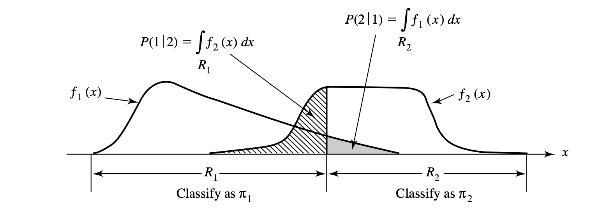
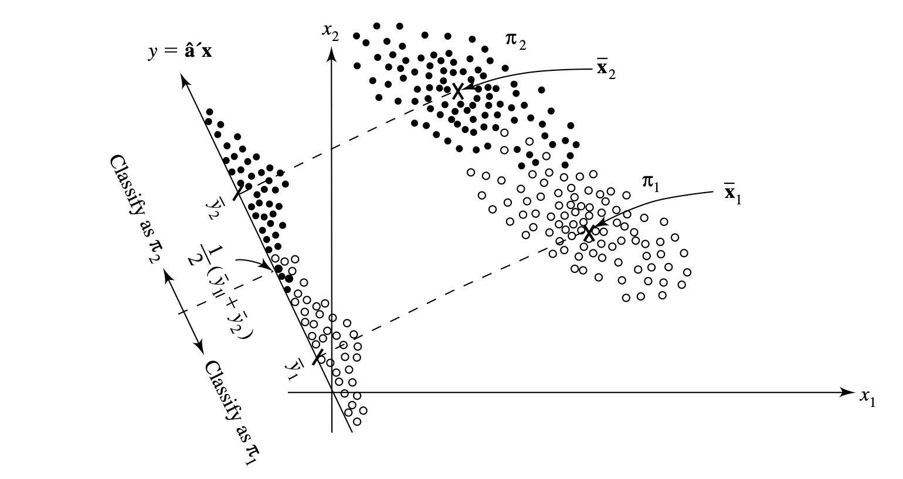

## Introduction
*Discrimination* is concerned with **separating** observations (seen as distinct sets of objects) from several known populations (seen as collections). *Classification* deals with allocating new observations to previously defined groups (classes) based on deriving a rule that can be used for optimal allocations. Both these techniques overlap and are treated similarly in this chapter due to a separator function can serve as an allocator, and an allocator may suggest a discriminatory procedure. 

## Separation and Classification for Two Populations
The classes are labeled as $\pi_1$ (for population 1) and $\pi_2$ for population 2. The two populations each have a probability density function of $f_1(\textbf{x})$ and $f_2(\textbf{x})$, respectively. The conditional probability of classifying an object as $\pi_2$ when it is actually $\pi_1$ is 
$$
P(2|1) = P(X \in R_2 | \pi_1) = \int_{R_2 = \Omega-R_1}f_1(x) dx
$$
, where $R_2$ is the set of $x$ values for which we classify objects as $\pi_2$ and $\Omega$ being the sample space - the collection of all possible observations - and having $R_1$ subtracted from this. This can be viewed as getting the volume or area ($p=2$) where the volume/area is in the region but the probability density function of the other population is in the region which was picked.

The prior probabilities $p_1$ and $p_2$ can also be multiplied with the misclassification probabilities which gives the overall probabilities of correctly or incorrectly classifying objects. The cost of misclassification is used when misclassifying one object as some class over another has a greater negative impact such as in the medical context, where a patient with a disease being predicted as healthy is much worse than the alternative.

The *Expected Cost of Misclassification* (ECM) are defined by the values $ECM = c(2|1)P(2|1)p_1 + c(1|2)P(1|2)p_2$

$$
R_1: \frac{f_1(x)}{f_2(x)} \ge \left(\frac{c(1|2)}{c(2|1)}\right) \left(\frac{p_2}{p_1}\right)
\\
\left(\text{density ratio}\right) \ge \left(\text{cost ratio}\right) \left(\text{prior prob. ratio}\right)
$$

The above (which can be used for $R_2$) are the regions that minimises the ECM. The cost ratio can be seen as some misclassification being $x$ times more costly than the other (depending on what's on the numerator and denominator). The special cases of minimum expected cost regions are with equal prior probabilities equalling to 1,  equal misclassification costs equalling to 1, and both equal prior probabilities and misclassification costs. When the prior probabilities are unknown or the misclassification cost ratio is indeterminate, they can be set as equal.

Another criteria of deriving "optimal" classification procedures is the *total probability of misclassification* $TPM = P(\text{observation comes from } \pi_1 \text{ and is misclassified}) + P(\text{observation comes from } \pi_2 \text{ and is misclassified} = \pi_1\int_{R_2}f_1(x)dx + p_2\int{R_1}f_2(x)dx$. The other criteria is using posterior probabilities. Both are equivalent with the ECM of assuming equal misclassification costs.

## Classification with Two Multivariate Normal Populations
For classification of normal populations with equal covariance matrices, use the minimum ECM regions but replace the density functions $f_i(x)$ with the multivariate normal density function. For random samples (this advice pertains to everything after as well), just replace $\Sigma$ with the pooled covariance matrix (since the covariance matrices are assumed equal/similar) and $\mu$ with $\bar{x}$. This works by creating two univariate populations for the y values by taking an appropriate linear combination of the observations and then assigning a new observation $x_0$ based upon its position relative to the midpoint between the two univariate means. 

Fisher's approach to classification with two populations is to use the linear combination $\hat{y} = \hat{a}^Tx = (\bar{x}_1 - \bar{x}_2)^TS^{-1}_{\text{pooled}}x$ which maximises the ratio between the squared distance between sample means of $y$ and sample variance of $y$. This just projects the points onto a line in the direction $\hat{a}$ and its direction is varied until the samples are maximally separated. 

To test whether we should even think of finding a useful classification rule, we can use the test of $H_0: \mu_1 = \mu_2$ since the classification wouldn't matter if the populations aren't even different enough to classify meaningfully. This is compared against the F-distribution.

When the covariance matrices are not equal, we use quadratic functions but caution must be exercised when doing this on a nonnormal distribution which can give large error rates. A better way to check the performance on any classification procedure is by having a separate "validation" sample, separate from "training" use.

## Evaluating Classification Functions
Having found the regions $R_1$ and $R_2$ from the *minimum expected cost regions*, the *optimum error rate* is
$$
\text{OER} = p_1\int_{R_2}f_1(x)dx + p_2\int_{R_1}f_2(x)dx
$$
The OER is the error rate for the minimum TPM classification rule. Another error rate is the *actual error rate* which is just replacing the population summary statistics with the sample analogs $\hat{R_1}$ and $\hat{R_2}$. However, both of these error rates are dependent on the form of the parent populations, the *apparent error rate* (APER) is just the fraction of observations in the training sample that are misclassified. It can be found out by using a confusion matrix. However, to estimate the error rate, we must not use the same data we used to train the classification rule as the validation sample as this causes bias and becomes optimistic (underestimating the error). The two problems, also with a validation sample, is it requires large sample and we'll have a loss of information that could have been used to construct the classification function. To solve this, we use *Lachenbruch's "holdout" procedure* which is more commonly known as *cross-validation*.

## Classification with Several Populations
The multiple populations extension for ECM is 
$$
ECM(1) = P(2|1)c(2|1) + \ldots + P(g|1)c(g|1)
\\
ECM = p_1 ECM(1) + \ldots + p_g ECM(g)
$$
Therefore, determining an optimal classfication procedure is dependent on choosing the mutually exclusive and exhaustive classfication regions $R_1, \ldots, R_g$ such that the above is a minimum. The minimum ECM classfication rule with equal misclassification costs is
$$
p_kf_k(x) > p_if_i(x) \text{ for all } i \neq k
$$

For normal populations, a quadratic discrimination score is used where the largest $d_k^Q(x)$ is where $x$ is classified. This can also be written as an estimate of the quadratic discrimination score $\hat{d}_i^Q$ if dealing with unknown $\mu_i$ and $\Sigma_i$. For equal covariance populations just use a pooled covariance matrix.

## Fisher's Method for Discriminating Among Several Populations
This is an extension of his discriminant method discussed before but for several populations. The purpose is to find convenient representations that reduce the dimension from a very large number of characteristics to a relatively few linear combinations. The vector of coefficients that maximise the ratio of the "sum of squared distances from the populations to overall mean of Y" with the "variance of Y" is $\hat{a}_1 = \hat{e}_1$ which is the *sample first discriminant*. For random samples, use $B$ for the *sample between groups matrix* and $W$ for the *sample within groups matrix*. Fisher's discriminant method can also be used to classify object by allocating some new observation to some population based on the square of the distance from the point $Y$ to the mean $\mu_{kY}$.

## Logistic Regression and Classification
If we want to classify *qualitative variables* such as gender and encoding it as 0 or 1, we would need to use logistic regression since the response $Y$ would be bounded between 0 and 1, and that the variance of $Y$ is constant across all predictor variables.

The logit model, first uses the *odds ratio* instead of directly using *p* (probability p is 1) with a linear model.  
$$
\text{odds} = \frac{p}{1-p}
$$

The logit is
$$
\text{logit} (p) = \ln (\text{odds}) = \ln \left(\frac{p}{1-p}\right) = \beta_0 + \beta_1 z
$$

If we write this in terms of $p(z)$, we get the logistic curve which is the relation between $p$ and $z$ which is an S-shaped graph. To get the $\beta$ estimates, we use the maximum likelihood estimate by using the Bernoulli distribution as the joint probability distribution functions. We can also get the confidence intervals for each $\hat{\beta}_k$ based on the large sample estimated standard deviations or *standard errors* (SE). For classification we use the estimated odds function or logit function and if it is greater than 1 or 0 respectively, it is assigned to population 1.

## Final Comments
For including qualitative variables, there is little evidence where available to handle the case where some variables are continuous and others qualitative. Classification trees are also used using the *classification and regression trees* (CART) procedure which uses splitting of nodes from one variable to another to classify an observation depending on which terminal node it lands on. They also talked about neural networks and the selection of variables using *stepwise discriminant analysis* for a large number of variables. 

Using MANOVA, we can also test for whether the populations are well separated, and if not, classification should not be attempted as it is a waste of time.
