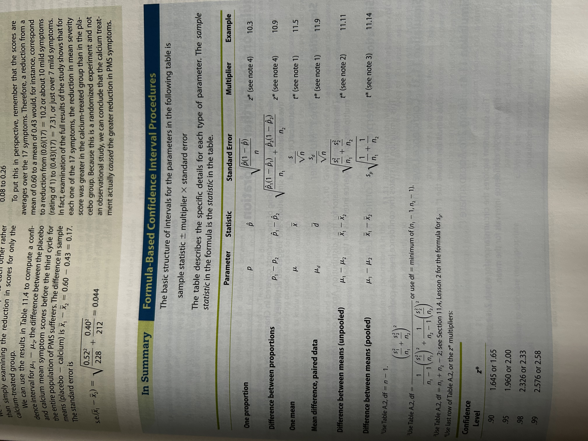

## Introduction
- Explain the difference between quantitative data collected to create paired differences and data collected as two independent samples
- Describe what the standard error of a statistic represents
- Calculate a confidence interval for one mean of the mean of paired differences
- Identify the appropriate confidence interval formula for the difference in means for independent samples, choosing from the pooled and unpooled method
- Interpret confidence intervals for one mean, the mean of paired differences, and the difference in means for independent samples
- Explain when to use a z-distribution and when to use a t-distribution for computing confidence intervals
- Explain the conditions required for using t confidence intervals for means
- Demonstrate how to create a bootstrap confidence interval for one mean, the mean of paired differences, the differences in two means, and several other parameters, given an appropriate dataset

## Confidence Intervals for Means

> **paired data:** means that data have been observed in natural pairs:
- The same measurement taken twice on each person under different conditions
- Similar individuals are paired before giving the treatments in an experiment. Each member of a pair then receives a different treatment. The same response variable is measured for all individuals
- Two different variables are measured for each individual. There is interest in the amount of difference between the two variables.

## Confidence Intervals - 1 Population Mean
Conditions for t Confidence Interval for One Mean to be valid:
- The population is bell-shaped and a random sample of any size is measured. For small sampmles, the data should show no extreme skewness and should not contain any outliers.
- A large random sample is measured. $n \geq 30$, should be larger if outliers or extreme skewness present.

$$
\bar{x} = t* \cdot \frac{s}{\sqrt{n}}
$$

Make sure to interpret confidence interval correctly.
> "We are C% confident that the computed interval covers the true mean of the population represented by the sample."

Prove confidence interval formula works

## Confidence Interval - Population Mean of Paired Differences
Same conditions as above.

$$
\bar{d}\space \pm t* \cdot \frac{s_d}{\sqrt{n}}
$$

## Confidence Interval - Difference in 2 Population Means
Same conditions as above.

**Two-Sample t-interval**

Unpooled (General) Case:

$$
(\bar{x}_1 - \bar{x}_2)\space \pm t* \cdot \sqrt{\frac{s_1^2}{n_1} + \frac{s_2^2}{n_2}}\\
\textrm{df} = \frac{(\frac{s_1^2}{n_1} + \frac{s_2^2}{n_2})^2}{\frac{1}{n_1-1}(\frac{s_1^2}{n_1})^2 + \frac{1}{n_2-1}(\frac{s_2^2}{n_2})^2}
$$
The above df formula is Welch's approximation and is an approximate multiplier. Can also use a conservative approach by choosing the lesser of $n_1 - 1$ or $n_2-1$ df.

> Assuming the two populations have the same variance gives a procedure for which the t* multiplier is mathematically correct.

Pooled Case:

$$
\textrm{pooled std. dev } = s_p = \sqrt{\frac{(n_1-1)s_1^2 + (n_2-1)s_2^2}{n_1 + n_2 - 2}}\\
\textrm{pooled s.e. }(\bar{x}_1 - \bar{x}_2) = \sqrt{\frac{s_p^2}{n_1} + \frac{s_p^2}{n_2}} 
$$

## Using Simulation to Calculate Confidence Intervals: Bootstrapping for Means and Other Parameters

