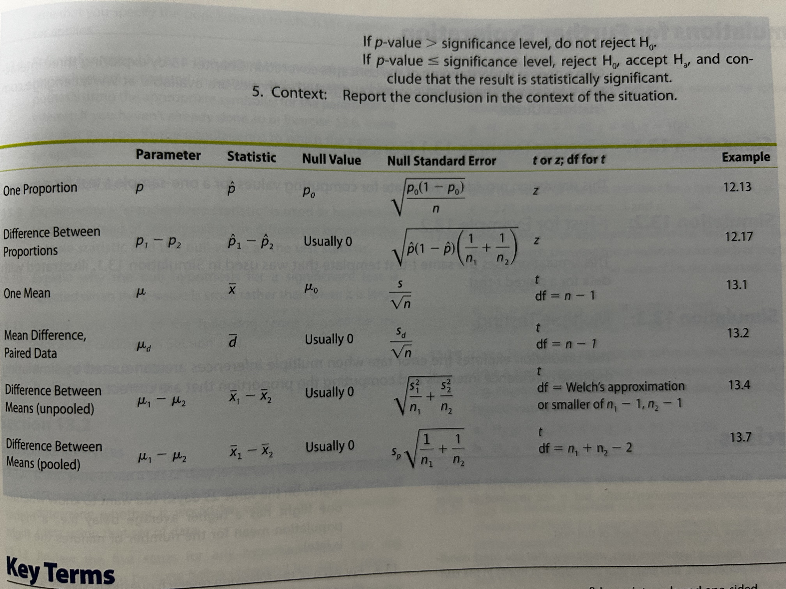

## Introduction
- Describe the five steps of hypothesis testing as applied to one mean, the mean of paired differences, and the difference in means for two independent samples
- Analyse whether the conditions required for t tests for means to be valid are met, given a dataset
- Identify the appropriate hypothesis testing method for the difference in means for independent samples, choosing from the pooled and unpooled method
- Demonstrate how to use resampling simulation to construct a randomisation test for the difference in two means, given a dataset with two samples
- Explain how to choose an inference procedure, including what parameter to use and whether to find a confidence interval, conduct a hypothesis test, or do both
- Explain what effect size represents, including how it relates to a test statistic, how it relates to power for a significance test, and how to determine if the effect is small, medium or large
- Evaluate the quality of statistical methods and results in a research study

## Hypothesis Testing for 1 Population Mean
Conditions:
- The population of measurements is approximately normal and a random sample of any size is measured. Because it is difficult to assess the true shape of the population from a small sample, in practice, the method is used as long as there is no evidence that the shape of the population is notably skewed or that there are extreme outliers.
- A large random sample is measured. $n \geq 30$. If there are extreme outliers or extreme skewness, it is better to have more than 30

$$
H_0: \mu = \mu_0
$$

This is a **one-sample t-test** because the t-distribution is used to determine the p-value.

$$
t = \frac{\bar{x}-\mu_0}{s/\sqrt{n}}
$$

with df=n-1

## Hypothesis Testing for Population Mean of Paired Differences
Same conditions as above

$$
t = \frac{\bar{d} - 0}{s_d/\sqrt{n}}
$$

**paired t-test**

## Hypothesis Testing for Difference in 2 Population Means
Same conditions as above

### Unpooled (General) Case
**two-sample t-test**
$$
t = \frac{(\bar{x}_1 - \bar{x}_2) - 0}{\sqrt{\frac{s_1^2}{n_1}+\frac{s_2^2}{n_2}}}
$$

Use Welch's Approximation for df or min($n_1-1, n_2-1$)

### Pooled Case
More precise than unpooled method. If we assumed two populations have the same/similar variance, then there is a procedure for which the t-distribution is the correct distribution of the t-statistic when the null hypothesis is true. **pooled two-sample t-test.**

$$
\textrm{pooled sample variance } = s_p^2 = \frac{(n_1-1)s_1^2 + (n_2-1)s_2^2}{n_1+n_2-2}\\
\textrm{pooled t } = \frac{(\bar{x}_1 - \bar{x}_2)-0}{\textrm{pooled std. error}}\\
\textrm{pooled s.e.} = \textrm{pooled s.e.}(\bar{x}_1-\bar{x}_2) = \sqrt{\frac{s_p^2}{n_1}+\frac{s_p^2}{n_2}}
$$

with df = $n_1 + n_2 - 2$

Guidelines:
- If $n_1 = n_2$, the pooled and unpooled s.e. are equal so the the t-statistic is the same for both procedures. It is still generally preferable to use Welch's approximate df but it is also acceptable adding both sample sizes - 2.
- If $n_1$ and $n_2$ are very different, the standard deviations are similar, and the larger sample size produced the larger std. dev., the pooled t-test is acceptable because it will be conservative.

### Randomisation Test

## The Relationship Between Significance Tests and Confidence Intervals
Confidence intervals should be used to supplement significance testing.

- For a two-sided alternative hypothesis, a two-sided confidence interval with confidence level $(1-\alpha)\cdot 100\%$ could be used to test the hypothesis. Reject $H_0$ if the confidence interval does not cover the null value.
- For a one-sided alternative hypothesis ($H_a:$ parameter > null value ), a two-sided confidence interval with confidence level $(1-2\alpha)\cdot 100\%$ could be used to test the hypothesis. Reject $H_0$ if the entire confidence interval falls above the null value.
- For a one-sided alternative hypothesis ($H_a:$ parameter < null value ), a two-sided confidence interval with confidence level $(1-2\alpha)\cdot 100\%$ could be used to test the hypothesis. Reject $H_0$ if the entire confidence interval falls below the null value.

## Effect Size
> **Effect Size:** How much the truth differs from chance or from a control condition. Helps evaluate magnitude of condition using a measure that allows researchers to compare results across studies.

Single Sample Effect Size for Means
$$
\hat{d} = \frac{\bar{x}-\mu_0}{s}
$$

Two Sample Effect Size for Means
$$
\hat{d} = \frac{\bar{x}_1 - \bar{x}_2}{s}
$$

Relationship between test statistic t and estimated effect size:
$$
t = \frac{\bar{x}-\mu_0}{s\sqrt{n}}, \textrm{ so } \hat{d}=\frac{t}{\sqrt{n}} \\
\textrm{for two samples,}\\
\textrm{pooled t } = \frac{\bar{x}_1 - \bar{x}_2}{s\sqrt{\frac{1}{n_1}+\frac{1}{n_2}}} = \frac{\hat{d}}{s\sqrt{\frac{1}{n_1}+\frac{1}{n_2}}}
$$

$$
\textrm{test statistic} = \textrm{effect size} \cdot \textrm{size of study}
$$

## Evaluating Statistical Results in Research Reports

>**Multiple Testing:** With each test and interval there is a chance that an erroneous conclusion will be made, so if multiple tests and intervals are considered, the chance of making at least one erroneous conclusion will increase. For 20 95% confidence intervals 1 will miss the truth value 20(0.05) = 1 or a type 1 error. 

The simplest and most conservative method to fix this is the **Bonferroni Method** which divides significance level across tests.

