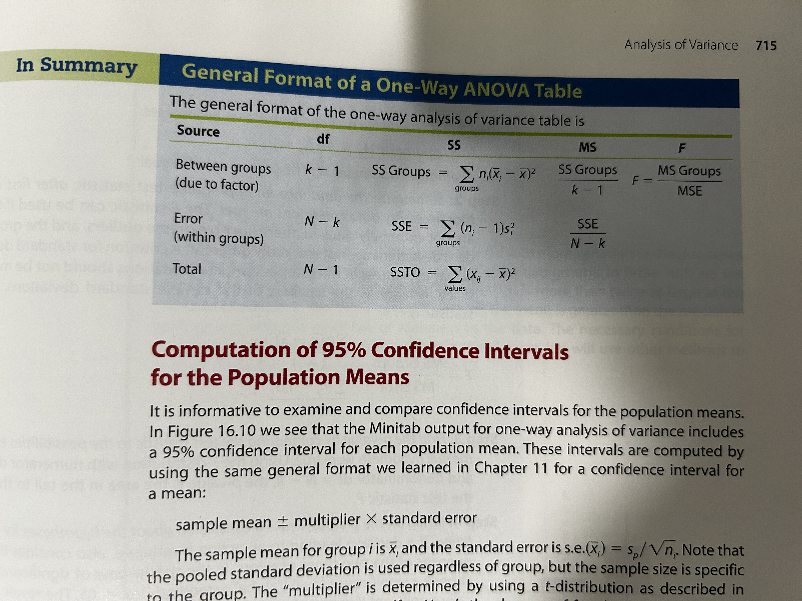
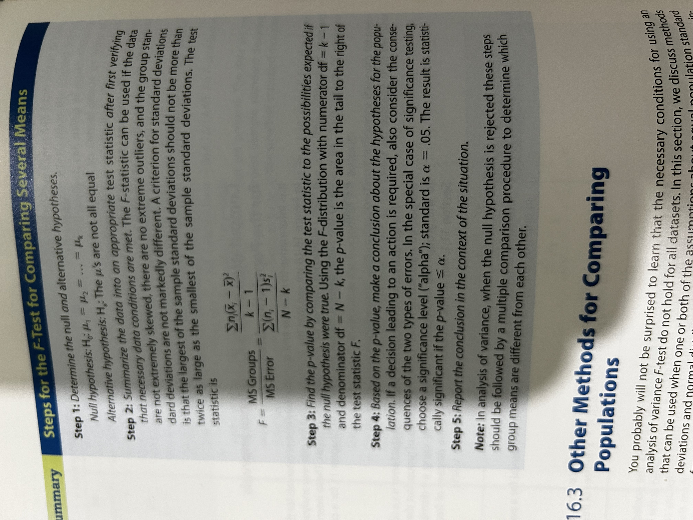

## Introduction
- Carry out a one-way ANOVA hypothesis test for equality of population means
- Explain the concept of analysing sources of variance as a method for comparing means
- Explain the distinction among various methods for comparing means with confidence intervals, including intervals for individual means, and the Tukey and Fisher methods for multiple comparisons
- Use confidence intervals to find which population means differ as a follow-up to one-way ANOVA hypothesis test
- Carry out a Kruskal-Wallis test for equality of population medians using statistical software
- Carry out a Mood's median test for equality of population medians using statistical software
- Explain the concepts of main effect and interaction in two-way analysis of variance
- Use an interaction plot to examine how two factors jointly affect a response variable
- Explain what can be tested with two-way ANOVA

The first step in the analysis of more than two means is to carry out a hypothesis test to determine if there are any differences at all between the population means being compared. This hypothesis test is part of a procedure called **analysis of variance.**

## Comparing Means with ANOVA F-Test

> **One-way ANOVA:** when different values of a single categorical explanatory variable/factor defines the populations being compared.

Conditions:
- Independent and random samples
- The distribution of the response variable is a normal curve within each population
- The different populations may have different means under the alternative hypothesis; the null hypothesis is that the means are equal
- All populations have the same standard deviation $\sigma$

The equal standard deviations assumption is **necessary** unlike the "unpooled" two-sample t-test procedure. A rough criterion is that the largest of the standard deviations should not be more than twice as large as the smallest of standard deviations

Step 1: Determine null and alternative hypotheses
$$
H_0: \mu_1 = \mu_2 = \ldots = \mu_k\\
H_a: \textrm{The population means are not equal}
$$

Step 2: Summarise the data into an appropriate test statistic
$$
F = \frac{\textrm{variation between sample means}}{\textrm{natural variation within groups}}
$$

Step 3: Find the p-value
Uses F-distribution.

Steps 4 and 5: Make conclusion and report within context.

$$
\textrm{numerator df} = \textrm{number of groups } k -1
\textrm{denominator df} = \textrm{total sample size } N - k
$$

Multiple comparisons easily done using ANOVA which compares many different population means.

> **Tukey's procedure** controls the family Type 1 error rate for multiple comparisons between pairs of population means.
>**Fisher's procedure:** is used for confidence intervals.

## Other Methods for Comparing Populations
When the observed data are skewed or extreme outliers are present, it is better to analyse the median than the mean (or if response variable is ordinal). 

$$
H_0: \textrm{population medians are equal or } \eta_1 = \eta_2 = \ldots = \eta_k  \\
H_a: \textrm{population medians are not ALL equal}
$$

>**Kruskal-Wallis Test:** is a test for comparing medians based on a comparison of the relative rankings (size) of the data in the observed samples and is called a *rank test*. It is also a *nonparametric test* since no assumptions about a specific distribution are made.

>**Mood's Median Test:** another *nonparametric test*

## Two-Way ANOVA
Examines how two categorical explanatory variables affect the mean of a quantitative response variable.
