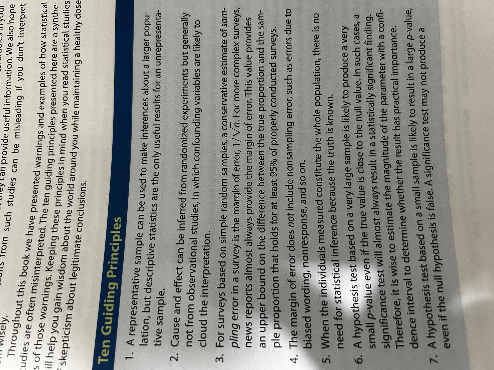

## Introduction
- Explain how the Fundamental Rule for Using Data for Inference applies to making conclusions from statistical studies
- Explain how the Rule for Concluding Cause and Effect applies to making conclusions from statistical studies
- Describe how nonstatistical considerations are used to assess cause and effect for one or more statistical studies
- Use statistical thinking to make decisions in daily life
- Identify situations for which statistical methods are useful for gaining information and wisdom
- Utilise statistical principles to determine what can be concluded from statistical studies
- Utilise statistical principles to determine when results presented from statistical studies are misleading.

> **Fundamental Rule for Using Data for Inference:** is that available data can be used to make inferences about a much larger group if the data can be considered to be representative with regard to the question(s) of interest.

> **The Rule for Concluding Cause and Effect:** is that cause-and-effect relationships can be inferred from randomised experiments but not from observational studies due to confounding variables balancing out in all treatment groups so the differences can only be attributed to the explanatory variable.

Using nonstatistical considerations to assess cause-and-effect:
- There is a reasonable explanation of cause and effect
- The connection happens under varying conditions
- Potential confounding variables are ruled out.

## Ten Guiding Principles

