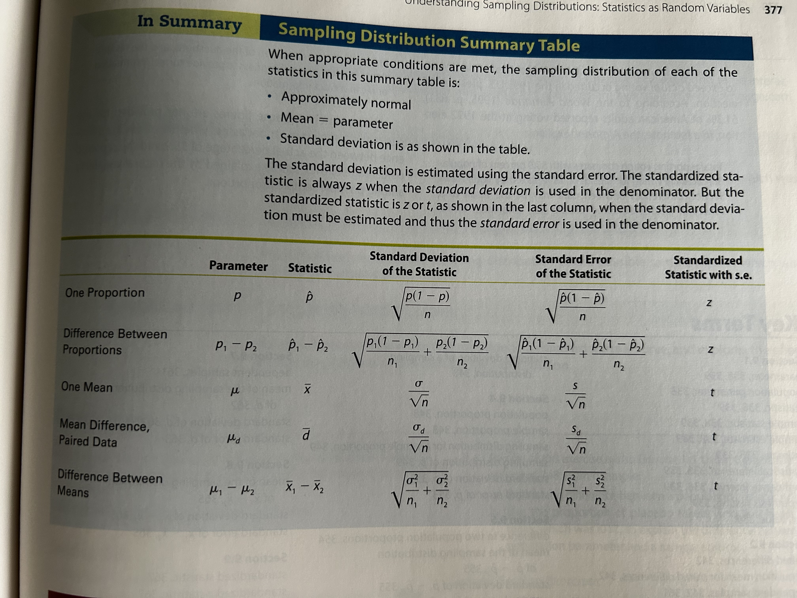

## Introduction
- State questions of interest in terms of parameters, including using appropriate notation
- Distinguish between sample statistics and population parameters
- Identify which of five parameters is appropriate to answer a question of interest, choosing from one proportion, difference in two proportions, one mean, a mean for paired differences, or difference in two means.
- Specify the sampling distribution for a sample proportion, including its mean, standard deviation, standard error, and shape.
- Specify the sampling distribution for a difference in two sample proportions, including its mean, standard deviation, standard error, and shape.
- Specify the sampling distribution for a sample mean, including its mean, standard deviation, standard error, and shape.
- Specify the sampling distribution for a mean of paired differences, including its mean, standard deviation, standard error, and shape.
- Specify the sampling distribution for a difference in means for two independent samples, including its mean, standard deviation, standard error, and shape.
- Calculate appropriate standardised statistics and probabilities associated with them using sampling distributions

## Parameters, Statistics, and Statistical Inference
Using **statistical inference** procedures to make conclusion about population parameters on the basis of sample statistics. The two most common procedures are **confidence intervals** and **hypothesis testing**.

> **parameter:** numerical summary of population

> **(sample) statistic:** numerical summary of sample. Its value may be different for different samples. 

## Overview of Sampling Distributions

> **Sampling Distribution:** is the probability distribution of possible values of the statistic for repeated samples of the same size taken from the same population.
The mean value of a sampling distribution is the mean value of a sample statistic over all possible random samples. This mean equals the value of the population parameter for inference.
The std. dev. mmeasures the variation over all possible random samples. 

> **Standard Error:** describes the estimated value of the standard deviation of a statistic. (formula of std. dev. uses sample statistic)

### Sampling Distribution - 1 Sample Proportion
For sufficiently large random samples of size n, 

$$
\textrm{mean} = p\\
\textrm{std. dev} = \sqrt{\frac{p(1-p)}{n}}\\
\textrm{s.e. of } \hat{p} = \sqrt{\frac{\hat{p}(1-\hat{p})}{n}} 
$$

### Sampling Distribution - Difference in 2 Sample Proportions
For sufficiently large random samples of size $n_1$ and $n_2$ from populations with means $p_1$ and $p_2$, 

$$
\textrm{mean} = p_1 - p_2\\
\textrm{std. dev} = \sqrt{\frac{p_1(1-p_1)}{n_1} + \frac{p_2(1-p_2)}{n_2}}\\
\textrm{s.e. of } \hat{p}_1 - \hat{p}_2 = \sqrt{\frac{\hat{p}_1(1-\hat{p}_1)}{n_1} + \frac{\hat{p}_2(1-\hat{p}_2)}{n_2}}
$$

### Sampling Distribution - 1 Sample Mean
For sufficiently large random samples of size n, 

$$
\textrm{mean} = \mu\\
\textrm{std. dev} = \frac{\sigma}{\sqrt{n}}\\
\textrm{s.e. of } \bar{x} = \frac{s}{\sqrt{n}}
$$

### Sampling Distribution - Sample Mean of Paired Differences
For sufficiently large random samples of n paired differences, 

$$
\textrm{mean} = \mu_d\\
\textrm{std. dev} = \frac{\sigma_d}{\sqrt{n}}\\
\textrm{s.e. of } \bar{d} = \frac{s_d}{\sqrt{n}}
$$

### Sampling Distribution - Difference in 2 Sample Means
For sufficiently large random samples of size $n_1$ and $n_2$ from populations with means $\mu_1$ and $\mu_2$, 

$$
\textrm{mean} = \mu_1-\mu_2\\
\textrm{std. dev} = \sqrt{\frac{\sigma_1^2}{n_1}+ \frac{\sigma_2^2}{n_2}}\\
\textrm{s.e. of } \bar{x}_1 - \bar{x}_2 = \sqrt{\frac{s_1^2}{n_1}+ \frac{s_2^2}{n_2}}
$$

## Standardised Statistics
How many standard deviations the raw score falls above or below the mean.
$$
z = \frac{\textrm{sample statistic} - \textrm{population parameter}}{\textrm{s.d.(sample statistic)}}
$$

Sample Proportion (standardised z-statistic):
$$
z = \frac{\hat{p} - p}{\textrm{s.d.}(\hat{p})} = \frac{\hat{p}-p}{\sqrt{\frac{p(1-p)}{n}}}
$$

Sample Mean (standardised z-statistic):
$$
z = \frac{\bar{x} - \mu}{\textrm{s.d.}(\bar{x})} = \frac{\bar{x}-\mu}{\sigma/\sqrt{n}}
$$

> There is an issue for calculating the standardised statistics for means, we rarely know the population standard deviations which is needed in the formula. We can approximate this by using sample standard deviation $s$. But for small sample sizes, the approximation does not conform to the standard normal distribution. The standardised statistic instead follows the **Student's t-distribution**

If a small random sample is taken from a normal population or large random sample taken from any population:
$$
t = \frac{\bar{x}-\mu}{\textrm{s.e.}(\bar{x})} = \frac{\bar{x}-\mu}{s/\sqrt{n}}
$$
with df = n-1.

> Law of Large Numbers

> Central Limit Theorem

